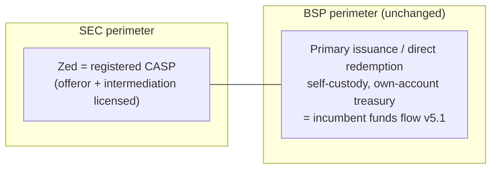

# Track A — OUSD accounts with a CASP registration (no VASP)

**Status:** exploring · opened 2026-09-14
**Thesis:** The incumbent architecture's principal unresolved risk is the SEC CASP perimeter (memo §5: Zed is plausibly an "offeror"/intermediary under MC 4, s. 2025). Track 0 answers that with interpretive relief / MC 5 exemption / StratBox. Track A answers it by **registering as a CASP**: the SEC question disappears as a *risk* and becomes a *compliance program*. Everything BSP-side is unchanged — Zed still holds no VASP authority, so the BSP no-VASP facts must be preserved exactly as in the memo.

## What carries over from Track 0 (ASSUMED until counsel says otherwise)

The BSP analysis does not care about SEC status. Every BSP-driven invariant survives:
- Primary issuance direct to user wallets (R27), no customer USD (R28), no Zed custody (R30), user signing (R31), own-account treasury (D10). The funds flow is **identical to the incumbent** (`../../funds-flow-bridge-kyb.html`) at the money-movement level.
- Bridge/Privy/Netbank roles unchanged; the C-BR/C-PR/C-NB tracker items remain load-bearing.

## What changes

| Area | Change | Tag |
|---|---|---|
| SEC posture | Registered CASP: offeror/intermediation activity is licensed, not exempted. C-LC-6..9 collapse into "maintain the registration" | ASSUMED |
| Marketing | Can market the offering openly within CASP conduct rules; less terminology fragility than Track 0 (D12 still applies for BSP/EMI reasons) | ASSUMED |
| Zero-spread requirement (R29) | R29 exists for the BSP *FX/dealer* argument, *not* the SEC one — so spread likely **still prohibited** on the issuance leg even with a CASP. Flag: this kills the naive "CASP lets us charge" intuition | ASSUMED — counsel |
| Product breadth | CASP may permit adding other crypto-assets/services later without new relief each time | PENDING counsel |
| Disclosure | MC 4 §5 offering-disclosure obligations likely attach directly to Zed as registered offeror | PENDING counsel |

## Research questions

- **A-Q1.** CASP registration under MC 4/5: capital requirements, fit-and-proper, timeline, ongoing obligations. Is it realistically obtainable by a lending company like Zed, and in what timeframe vs. the MC 5 exemption route? `PENDING counsel`
- **A-Q2.** Does holding a CASP change the BSP analysis at all (e.g., does BSP treat SEC-registered CASPs differently under M-2026-003 offshore-access, since the rule references BSP **or SEC** registration)? Note: if Bridge itself registered as a CASP, M-2026-003's carve-out might permit direct retail access — worth asking. `PENDING counsel`
- **A-Q3.** Conduct rules attached to CASP registration (custody segregation? conflicts? reporting?) — do any of them *conflict* with the self-custody/no-custody architecture? `PENDING counsel`
- **A-Q4.** Cost/benefit vs Track 0: if MC 5 exemption is genuinely available for a 50-user pilot, is CASP registration only the *scale-up* answer? (I.e., is A really "Track 0's Phase 3"?) `Steve + counsel`
- **A-Q5.** Can spread/fees be charged on any leg under CASP without re-triggering the BSP dealer analysis (see table row above)? This determines whether A has *any* revenue upside over 0. `PENDING counsel`

## Architecture sketch

Identical money movement to Track 0 — see the incumbent funds flow. Delta is regulatory wrapper only:

## Decision log

| Date | Event |
|---|---|
| 2026-09-14 | Track opened. Working framing: A = Track 0 with registration instead of relief; likely the scale-up posture rather than a pilot alternative. |
