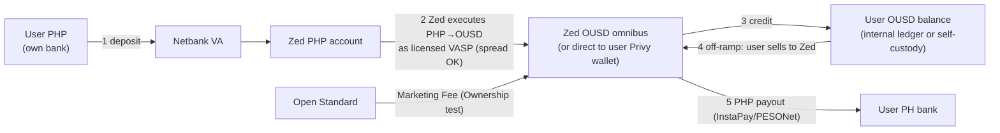

# Track B — OUSD accounts with a BSP VASP license (no CASP)

**Status:** exploring · opened 2026-09-14
**Thesis:** If Zed held a **BSP VASP license**, the entire contortion that defines the incumbent architecture — primary issuance, zero spread, no custody, direct redemption — becomes *optional* rather than legally load-bearing. Zed could operate a conventional exchange/wallet model: take customer PHP, execute the exchange as principal, hold OUSD omnibus (or not), charge spread, and run internal balances. The product gets simpler and monetizable; the licensing gets heavier. The SEC CASP question does **not** go away (it's an independent perimeter) — "no CASP" here means Track 0's SEC relief strategy still runs.

## What a VASP license unlocks (vs. incumbent invariants)

| Incumbent invariant | With VASP | Consequence |
|---|---|---|
| R27 primary mint only | Zed may hold/resell OUSD inventory | Instant on-ramps from inventory; no per-tx Bridge mint dependency (C-BR-2/3 stop being existential) |
| R28 no customer USD | Customer fiat/VA balances allowed (subject to VASP rules) | Conventional account UX possible |
| R29 zero spread | **Spread/fees legal** | Direct revenue on both ramps — the big economic unlock |
| R30 no custody | Omnibus custody allowed | Simpler UX (no signing ceremonies), instant internal transfers, recoverable "accounts" |
| D10 own-account-only FX | Customer FX permissible under MSB/VASP frame | Treasury simplifies |
| Direct-redemption off-ramp | Customer can sell OUSD **to Zed** | Off-ramp independent of Bridge redemption mechanics |

Self-custody via Privy can still be *offered* (it's a feature, not a constraint) — a licensed Zed choosing self-custody keeps the trust story while shedding the legal fragility.

## Costs / risks

- **B-Q1 (threshold question).** Is a new VASP license *obtainable at all*? BSP imposed a moratorium on new VASP licenses (2022, ~3 years); status as of late 2026, any reopening, and whether acquiring an existing licensed VASP is the realistic path. `PENDING counsel` — this question decides whether Track B is real.
- **B-Q2.** Capital, systems, and organizational requirements (Circular 1206 M-Regulations) for a VASP; can they sit inside Zed's existing entity or does this need a sister entity? Timeline realistically 6–18 months? `PENDING counsel`
- **B-Q3.** Does VASP status change the SEC CASP analysis (helpfully or harmfully)? Does an SEC CASP registration become *more* necessary once Zed openly exchanges? `PENDING counsel`
- **B-Q4.** Custody obligations that come *with* the license (safekeeping standards, proof-of-reserves, segregation) — cost of running them at pilot scale. `PENDING counsel`
- **B-Q5.** Does Bridge/OS's partner model support a licensed-exchange distributor (inventory purchases, omnibus holding) — and does Marketing Fee accrual work on omnibus balances (registered-wallet attribution says yes mechanically: Ownership test)? `PENDING Freddie`
- **B-Q6.** Commercial: spread revenue at pilot/scale vs. license cost — the actual business case. `Steve/finance`

## Architecture sketch (hypothesis — conventional licensed model)

Note the reversal: user balances *may* become ledger liabilities here (kills R23's rationale), which pulls in the full weight of custody reconciliation — §6.8 would need a real rewrite, not a tweak.

## Decision log

| Date | Event |
|---|---|
| 2026-09-14 | Track opened. Gating question is B-Q1 (moratorium/acquisition path); everything else is moot if no license path exists. |
