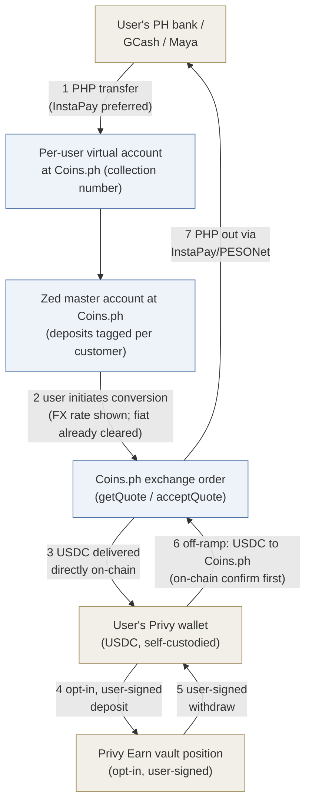

# Zed USDC Dollar Wallet — Product Requirements Document

**Status:** Draft v0.3 (2026-09-24) — settled facts only; decisions marked `OPEN` are for joint resolution (none silently assumed). Written as a **standalone product proposal** (no cross-track framing, per Steve 9/23).
**Surfaces:** working copy = collaborative Claude Doc (claude.ai/code/artifact/0bd0af8e-52f1-4d22-9d88-4251da290eac); team copies = Word files in Drive under Shared drives/Product/USDC Accounts (refreshed on meaningful revisions); this repo file mirrors the working copy at checkpoints. Team copies carry no internal-workflow language.
**IDs:** product decisions `C-D*`, requirements `C-R*`; research questions (C-Q*) and Coins.ph technical questions (OQ-*) tracked separately.

**Changelog v0.3 (2026-09-24):** the three-part build decomposition (KYC/onboarding · account interface · yield/vault) made front and center for design and engineering: new §1.2, and the §5 requirement groups relabeled to the same part names (Steve, 9/24).
**Changelog v0.2 (2026-09-23):** design-intro call (Granola notes → SOURCES.md) settled **C-D11 (yield = opt-in)** and **C-D14 (two-step deposit flow, FX rate shown at conversion)**; set the product priority ladder (USD acquisition must-have · yield stretch · QR payments out of pilot); InstaPay-first rail preference; TMMFs elevated to the design team's preferred yield alternative pending the SRC §8 question (now design-blocking); positioning principles added; standalone-ized (all cross-track references removed). New follow-ups: Wise deposit-flow reference screenshots; Andy design session; OQ-10.
**Changelog v0.1 (2026-09-23):** initial draft from the Coins.ph integration thread + Create-Customer V2 spec, the Privy Earn research, the onchain-lending analysis, and Steve's direction (Coins.ph onramp → self-custodied Privy wallet → Privy vault yield; TMMFs exploratory given SRC §8).

---

## 1. Summary

Zed offers Philippine customers a dollar-denominated account holding **USDC** in a **genuinely user-owned, self-custodied Privy wallet**, with an optional **yield feature powered by Privy Earn** (deposits into a curated onchain lending vault). The regulated PHP↔crypto exchange leg is performed by **Coins.ph, a BSP-licensed VASP**, as principal: users on-ramp by paying PHP into a per-user virtual account, and Coins.ph converts and **delivers USDC directly to the user's Privy address** as part of the same order — Zed never takes custody of user crypto. This is the "rent the license" architecture: the licensed party does the licensed thing; Zed provides the product, the wallet software, and the distribution. (Working name: "Dollar Wallet" — final naming is C-D9.)

**Why this architecture:** the exchange leg sits with a domestically licensed VASP rather than an offshore counterparty; yield economics are Zed-configurable (vault fee share) rather than issuer-set. Trade-off: yield derives from onchain lending markets, inheriting decentralized-finance ("DeFi") characterization questions addressed in §§4–5 — handled under the same posture discipline as Zed's other stablecoin work: no customer fiat balances on Zed's books; no "deposit," "interest," or customer-FX framing.

### 1.1 Problems we're solving for the user

1. **Make it easy to acquire USD (or a proxy).** Philippine users have no simple way to hold dollars. *Our answer:* PHP in from their bank, GCash or Maya → Coins.ph converts → USDC lands in their own wallet (C-D4, C-D14).
2. **Earn a meaningful yield on a USD-denominated balance.** *Our answer:* optional Privy Earn vault deposits, variable and loss-possible (C-D5, C-D11, C-D13). Tokenized money-market funds remain a side option (§4).
3. **Spend a USD-denominated balance via QR Ph.** *Not yet discussed; outside MVP scope (C-D1: no payments or spend).* Listed so it shapes the architecture now (e.g. whether an off-ramp at the point of sale is fast enough), without committing to it for the pilot.

Priority order (design intro, 9/23): **#1 must-have · #2 stretch · #3 out of pilot** — ship #1 alone if time-constrained; the pilot validates demand, not the forever product. Positioning principles: **"preserve wealth" over "grow savings"** (peso-depreciation framing); never present yield in isolation (6% on pesos net of ~10% currency loss is worse than 4% on USD); design for the literacy gap (users may not know or fully trust USDC vs. a USD bank account).

### 1.2 What we're building — three parts

The build decomposes into three parts. Every screen, requirement, and open question in this document belongs to one of them; design and engineering should treat them as the top-level workstreams:

1. **Know Your Customer (KYC) & onboarding.** Provision the user end to end: create the Coins.ph customer from Zed's existing Persona onboarding data, walk the user through Coins.ph's in-app verification page (mobile PIN, "MPIN"), create the per-user virtual account, and create the self-custodied Privy wallet — one session where possible. Requirements C-R1–C-R3. Open: enum mapping tables (OQ-9); which app surface this lives in (C-D7, §3.4).
2. **Account interface.** Balances and the purchase: show the USDC balance (on-chain is the source of truth) and the unconverted-PHP balance (Zed's ledger mirror of customer funds held at Coins.ph), and let the user make the USDC purchase — user-initiated, with the FX rate disclosed at the moment of conversion (C-D14) — plus the off-ramp back to PHP. Requirements C-R4–C-R8; ledger design in `research/php-ledger-design.md`.
3. **Yield / vault.** The opt-in Privy Earn feature: user-signed vault deposits and withdrawals, variable-yield display with loss-possible disclosures, Zed's fee share to the admin wallet. Requirements C-R9–C-R12. Gated on Philippine availability confirmed in writing (C-R13) and the vault-venue choice (C-D12).

## 2. The funds flow (settled shape)

Key structural facts (source: [the Coins.ph Slack thread, 9/14–16](https://zedfinancial.slack.com/archives/C09HS2FTGTG/p1789436387222499) + their Create-Customer V2 spec; per-fact attribution in `research/coinsph-integration.md`):
- **Two-step deposit (C-D14, settled 9/23):** PHP lands and clears first; the user then initiates conversion with the FX rate shown at that moment — avoiding rate lock-in and fiat-clearing timing risk, and creating a user-visible unconverted-PHP state (C-R4a; stale-balance policy = C-D17, held). Once initiated, conversion and on-chain delivery are **one bundled Coins.ph order** (their 9/15 description — no intermediate USDC custody stop; convert-then-hold optionality → OQ-11).
- Sequenced settlement in both directions (fiat clears → crypto sends; crypto confirms on-chain → PHP releases). No Zed float in the crypto leg.
- PHP transits **Zed's master account at Coins.ph** (tagged per customer) → Zed-controlled fiat at the Coins layer → ledger/recon obligations (C-R7).
- No per-user balance API ("total balance across your users needs to be tracked on your end" — their 9/14 recap). For USDC, the chain is the source of truth; **for unconverted PHP, Zed's own ledger is the authoritative per-user record** — nothing at Coins.ph is queryable per user, only tagged cash-in webhooks and order events (C-R7/C-R7a; OQ-12). Position: these are customer funds held at Coins.ph — Zed's ledger mirrors them, it does not hold them (C-R4b).

## 3. Decisions

### 3.1 Settled

| # | Decision | Choice | Basis |
|---|---|---|---|
| C-D1 | Product core | USDC store-of-value account + **optional** yield; no payments/spend in MVP (priority ladder: §1.1) | Store-of-value-only scope discipline at launch |
| C-D2 | Stablecoin | **USDC** | Coins.ph supports USDC/PHP live; Privy Earn USDC vaults self-serve |
| C-D3 | Custody | User-owned, self-custodied Privy wallet; open-loop; no Zed signer/keys; all outbound user-signed | No-unilateral-Zed-signing posture; Privy config confirmations pending (C-PR-1..5) |
| C-D4 | On-ramp | **Coins.ph VASP partnership**: create-customer (Persona pass-through) → per-user VA → user pays PHP → exchange order delivers USDC **directly to the user's Privy address**. **InstaPay preferred over PESONet for MVP** (settlement lag + 1–2% intraday FX risk — 9/23) | Coins.ph thread + V2 spec; KYC details → C-D10, OQ-1/3 |
| C-D5 | Yield mechanism | **Privy Earn** vault deposits, user-authorized from the user's own wallet | Signing model per Privy tech docs |
| C-D6 | Off-ramp | Reverse Coins.ph flow: user-signed USDC → on-chain confirmation → PHP via InstaPay/PESONet | Coins.ph recap; detail pending (OQ-4) |
| C-D11 | Yield enrollment | **Opt-in (settled 9/23, design intro):** users intentionally move funds into the vault; base account holds plain USDC with no vault risk | Consent/disclosure UX to be designed (Andy session) |
| C-D14 | On-ramp UX | **Two-step deposit flow (settled 9/23)** — mechanics and rationale in §2. Persistent FX tracker deferred from MVP | Wise deposit flow = UX reference; mechanics → OQ-10/OQ-11 |

### 3.2 Proposed defaults

| # | Decision | Proposed default | Note |
|---|---|---|---|
| C-D7 | Client surface | **REOPENED 9/23 → §3.4** (prior default: web app embedded in the existing app's webview). Constant either way: JWT/OIDC bring-your-own-auth into Privy | Full option tree + decision inputs in §3.4; to be decided with design + engineering |
| C-D8 | Backend home | Bounded module in `zed-rust-api` (own tables/routes, feature-flagged) | Existing production Coins.ph client (card payments) — evaluate reuse vs. isolate |

### 3.3 OPEN — remaining

| # | Decision | The question | Preliminary suggestion |
|---|---|---|---|
| C-D9 | Naming/branding | What users see; USDC/Circle disclosure prominence | Inherit "Dollar Wallet" frame + terminology discipline; Steve's call + compliance floor |
| C-D10 | KYC mode | Merchant-hosted vs. hosted Ramp widget | Merchant-hosted, with the required Coins H5 verification step embedded in our webview (OQ-1: what's on it, can it be minimized) |
| C-D12 | Vault venue | Confirm single-Morpho-Prime-vault lean; then Gauntlet vs. Steakhouse | Follow the curator-diligence memo, not the APY print |
| C-D13 | Fee share / user rate | Zed's cut of vault yield (Morpho ≤50%) | At ~4.4% gross, 25% share → user ~3.3%. Model competitive positioning before setting |
| C-D15 | Pilot cohort and limits (proposed: 50 invite-only existing cardholders, conservative caps) | — | Not yet discussed; proposal as stated |
| C-D16 | Chain | Base (Earn USDC vaults available self-serve on Base) | Blocked on OQ-2: Coins.ph USDC delivery on Base |
| C-D17 | Stale unconverted-PHP policy | Cleared PHP sitting unconverted: auto-refund to source after N days vs. nudge-only (auto-convert rejected — violates C-R4b(c)) | **HELD as a key decision (Steve, 9/23).** Auto-refund ends indefinite nudging and reinforces the interface-not-holder position — returning funds is the only instruction-free disposition consistent with C-R4b(c)/(d). Interacts with OQ-10, OQ-13 |

### 3.4 Open platform & design decisions (for the design + engineering session)

Added 9/23 (Steve): the client surface was inherited as a proposed default and deserves a first-principles discussion before build. **C-D7 is reopened**; the decision tree:

**Q1 — Standalone app, or part of the existing Zed app?**
- *In-app:* ~11k existing cardholders one tap away; shared auth/session; no install funnel. Against: couples release risk and app-store review to the card app; the wallet reads as "a feature," which may undercut the preserve-wealth positioning (§1.1).
- *Standalone:* distinct brand and room to become the forever product; independent release cadence; review-risk isolation. Against: new install friction; a second app to maintain. (Auth is not a blocker either way — JWT/OIDC bring-your-own-auth.)

**Q2 — If standalone: web or mobile app?**
- *Web:* fastest iteration, zero store review. Against: PH consumer expectations are app-first; push notifications and passkey UX are weaker on mobile web.
- *Mobile:* store presence and credibility; full native capability. Against: store review cycles, including Apple/Google crypto-app policies (self-custody wallets are permitted, but review adds latency and policy exposure).

**Q3 — If mobile (standalone or in-app): implementation approach.**

| Option | For | Against |
|---|---|---|
| (a) Mobile web app (React) embedded in a tab/webview | One codebase; daily deploys with no store cycle; Privy's React SDK is the most mature surface; precedent exists in the current app | Wallet signing/passkey UX inside a webview is the weak point; Coins' H5 verification page becomes webview-in-webview (OQ-1) |
| (b) React Native (or other cross-platform) module | Native feel; Privy ships a React Native SDK; one implementation across iOS/Android; portable into the existing apps as a module | New stack in the mobile codebase; store-cycle deploys; bridge/upgrade maintenance |
| (c) Fully native iOS + Android | Best platform integration (passkeys, biometrics); Privy ships Swift and Android SDKs | Two implementations; slowest iteration; largest team cost |

**Decision inputs to gather before the session:**
1. Privy SDK maturity per surface — especially embedded-wallet **signing UX** and passkey/recovery flows in webview vs. React Native vs. native (verify against Privy docs; good question for their forward-deployed engineer).
2. Coins.ph H5 verification page behavior inside each surface (OQ-1).
3. Deploy-cadence needs during the pilot (daily web iteration was decisive in the prior default).
4. Positioning interaction with C-D9: standalone supports the preserve-wealth brand; in-app supports adoption.
5. Team skills/capacity (React vs. RN vs. Swift/Kotlin) against the pilot timeline.
6. App Store / Play review-risk appetite for a crypto-adjacent product.

**Constraints that hold regardless of the outcome:** JWT/OIDC bring-your-own-auth into Privy; every wallet action user-signed (C-R9); terminology discipline (C-D9/C-R12).

## 4. Yield side-option under exploration: tokenized money-market funds ("TMMFs")

Held open, not in MVP scope — **and elevated at the 9/23 design intro: the design team's preferred yield alternative** if the regulatory question clears; **the Section 8 status must be resolved BEFORE the yield flow is designed** (now design-blocking, not just launch-gating). The attraction: Treasury-bill-backed yield (~3–4%), countercyclical, less speculative, easiest regulator story — reachable via the same Privy Earn API. **The concern:** a fund share offered to Philippine retail plausibly triggers **SRC Section 8** (registration before securities are sold/offered in the PH) — "Zed Invest territory." **Gates:** counsel opinion; Privy TMMF availability/eligibility for PH users. If DeFi-vault characterization fails at counsel, TMMF-with-registration becomes the fallback rather than the sidecar.

## 5. Requirements

Grouped by the three build parts (§1.2), plus cross-cutting gates that span all three.

**Part 1 — KYC & onboarding (provisioning)**
- C-R1. Onboarding creates: Privy wallet (user-sole-owner config), Coins.ph user via create-customer V2 (Persona data + live-captured device context: IP/source/user-agent), per-user VA — one session where possible. The Coins H5 verification page is a designed in-app step with defined handling for MPIN timeout ("Failed") and abandonment ("Cancelled"). All five KYC webhook statuses map to product states; Rejected/Failed alert ops with a user-facing "in review" state.
- C-R1a *(backend-verified 9/23)*. Field mapping from existing Zed data: `employment_type` enum (needs mapping table to Coins' EmploymentStatusEnum); `source_of_funds`, `industry`, `employer`→companyName, `job_function`→jobTitle, `citizenship`→nationality, `place_of_birth`→countryOfBirth (**verify format: country, not city**) — all in `user_profile_changelog`. Device context captured live from the requesting session. Net-new: `purposeOfAccount` (likely programmatic constant — confirm), enum mapping tables (OQ-9), AMLC-cert path for covered_service (rare — possible pilot exclusion).
- C-R2. Coins.ph dedup (existing `coinsUserId` on phone+email+name+DOB match) is a first-class path.
- C-R3. Consents recorded; yield-feature terms separate (C-D11 = opt-in).

**Part 2 — Account interface & money movement**
- C-R4. Every on-ramp records: PHP in (cash-in webhook), order/quote refs, applied rate, USDC delivered, destination address, tx hash — reconcilable end to end.
- C-R4a *(new v0.2)*. The two-step flow introduces a **user-visible PHP-pending state** (funds received, awaiting user-initiated conversion): displayed clearly, with the FX rate shown at conversion time and nudges for stale un-converted balances (policy → OQ-10).
- C-R7a *(added 9/23 — consequence of C-D14 + no per-user balance API)*. **The PHP subledger is a first-class subsystem — an operational mirror, not the account of record (position: Coins.ph holds these customer funds; C-R4b):** every user-visible unconverted-PHP balance derives solely from Zed's ledger — credits from tagged cash-in webhooks, debits from conversion orders and refunds. Reconciliation anchors: Coins.ph order/transaction records and the master-account aggregate (balance/statement API availability → OQ-12). Any discrepancy between a displayed pending balance and Coins-side records is a paged break. Design: `research/php-ledger-design.md` (v0.1, follows the Shadow Ledger Redux conventions).
- C-R4b *(position discipline — Steve, 9/23)*. **Unconverted PHP is customer money held at Coins.ph under its VASP authority; Zed is the interface to it.** Facts the product must preserve to sustain that position: (a) the user is a genuine Coins.ph customer (`coinsUserId`, Coins' own screening; the H5/MPIN step affirmatively evidences the direct relationship); (b) deposits are attributed per customer by Coins' own tagging at entry; (c) disposition happens only on the user's instruction — conversion or refund — never a Zed-initiated sweep, netting, or redirection; (d) refunds return to the funding source, never to Zed; (e) no Zed corporate funds transit the customer master account; (f) UI language presents unconverted PHP as funds "held with Coins.ph awaiting your conversion," never as a Zed balance. Coins.ph written confirmation of this custody position → OQ-12.
- C-R5. Per-operation state machines; terminal states only completed/refunded/failed-with-ops-resolution.
- C-R6. Unmatched/failed/stuck orders alert ops; refund-to-source default (confirm path — OQ-3).
- C-R7. Double-entry ledger over Zed-controlled funds at the Coins.ph layer; user balances NOT ledger liabilities — on-chain is source of truth. Daily recon: ledger vs. Coins.ph orders vs. on-chain deliveries vs. Privy data.
- C-R8. Webhooks verified/idempotent (HMAC known for create-customer; rest → OQ-6).

**Part 3 — Yield / vault (custody)**
- C-R9. No Zed signer/key on user wallets; all outbound transactions user-signed (verify config per C-PR-1/2 + sandbox).
- C-R10. Vault ops only via user-authorized Earn wallet actions; no pooling, no Zed omnibus position.
- C-R11. Zed's Earn fee share → dedicated Zed admin wallet under Privy key-quorum manual approvals (dual control in-platform).
- C-R12. Yield display: variable, never "interest"/guaranteed APY; loss-possible + withdrawal-timing disclosures; comparative framing per positioning principles (never yield-in-isolation).

**Cross-cutting — gates before external users**
- C-R13. Philippine availability of Privy Earn confirmed in writing (C-Q6 — threshold item).
- C-R14. Counsel: DeFi-yield-to-retail characterization (C-Q12); Coins.ph-partnership legal shape incl. whose order the exchange is (C-Q10/OQ-8); **TMMF/SRC §8 — design-blocking (9/23)**; and validation of Zed's position on unconverted PHP (C-R4b): customer funds held at Coins.ph under its VASP authority, with Zed as interface — counsel to confirm the fact pattern that sustains it and flag anything that would recharacterize it as Zed-administered stored value.
- C-R15. Vault diligence memo on chosen venue.
- C-R16. Runbooks: stuck order, Coins.ph outage, Privy outage, vault liquidity crunch, pilot halt with off-ramp priority.

## 6. Status board — open decisions, counterparty confirmations & next steps

This section is the live "where are we" view for everyone building the product. Coins.ph items are **canonically tracked here** (the integration doc keeps the technical elaboration); Privy configuration items keep canonical status in the shared counterparty tracker (they serve more than one product) and are mirrored here.

### 6.1 Open product decisions

C-D7 platform/surface (§3.4 — design+eng session) · C-D9 naming · C-D10 KYC mode (blocked on OQ-1) · C-D12 vault venue · C-D13 fee share · C-D15 pilot scope · C-D16 chain (blocked on OQ-2) · C-D17 stale-balance policy (HELD). Detail in §§3.3–3.4; ledger design questions D-L1–D-L4 in the ledger design doc.

### 6.2 Coins.ph confirmations (canonical here; detail in the integration doc)

| ID | Question (condensed) | Blocks | Status |
|---|---|---|---|
| OQ-1 | H5 verification page: contents, duration, embeddability, timeout recovery | C-D10, onboarding UX | Open |
| OQ-2 | USDC delivery chains — Base? | C-D16 | Open |
| OQ-3 | Quote mechanics: validity window, over/under-payment, refund path | C-D14 detail, C-R6 | Open |
| OQ-4 | Off-ramp API detail (deposit address, attribution, rails, fees) | C-D6 | Open |
| OQ-5 | Fees / FX spread economics; any rev-share | Unit economics | Open |
| OQ-6 | Webhook auth, retries, idempotency; sandbox↔prod parity | C-R8 | Partially answered (HMAC scheme known for create-customer) |
| OQ-7 | Limits and compliance thresholds | C-D15 | Open |
| OQ-8 | Whose order is the exchange (user's vs. Zed's) | Counsel C-Q10 | Open |
| OQ-9 | Enum tables (employment/ID/country/status); purposeOfAccount as constant? | C-R1a mapping | Open |
| OQ-10 | Two-step mechanics: unconverted holding period, per-deposit orders, InstaPay-first routing | C-D14, C-D17 | Open |
| OQ-11 | Delivery model: always bundled to destination address, or convert-then-hold variant (whose balance)? | Custody posture | Open (Zed prefers bundled) |
| OQ-12 | Recon supports: aggregate balance API/statements; coinsUserId-level attribution; **written custody confirmation** | C-R7a, C-R4b | Open |
| OQ-13 | Fiat-out for unconverted PHP: refund-to-source and/or user withdrawal via API | C-D17, C-R6 | Open (rails exist; API access undocumented) |
| OQ-14 | Cash-in webhook fires on cleared funds only; post-webhook recall behavior per rail | Ledger D-L2, adjustment path | Open (thread-consistent; confirming) |

### 6.3 Privy confirmations (canonical status: shared counterparty tracker)

| Item | Status | Gate |
|---|---|---|
| C-PR-1/2 — user-sole-owner config, no Zed signer | Docs-supported; verify our app's configuration + sandbox | Pilot-blocking |
| C-PR-3 — export/recovery usable independently of Zed | Open | Pilot-blocking |
| C-PR-4/5 — open-loop sends; signing directly to third-party addresses | Supportive docs; verify in sandbox | Pilot-blocking |
| C-Q4 residual — Earn deposits/withdrawals user-signed under our config | Docs-level answered; sandbox verification pending (App ID live) | Pilot-blocking |
| **C-Q6 — Philippine eligibility for Privy Earn** | **Open — the threshold item; ask in writing** | Launch-blocking |
| Vault fee-share + admin-wallet quorum setup | Mechanics known from docs; configure at C-D12/C-D13 decision | Build item |
| SDK maturity per surface (signing/passkey UX in webview vs. RN vs. native) | Gathering — input to §3.4 | Session prep |

### 6.4 Counsel items

| Item | Status |
|---|---|
| C-Q10 + OQ-8 — legal shape of the Coins.ph partnership, incl. whose order the exchange is | Open |
| C-Q12 — offering DeFi lending yield to Philippine retail | Open |
| C-Q14 — TMMF / SRC §8 registration question | Open — **design-blocking (9/23)** |
| C-R4b validation — unconverted PHP as customer funds held at Coins.ph (interface-not-holder position) | Position stated (Steve 9/23); counsel to validate fact pattern |

### 6.5 Next steps

1. Resolve remaining decisions C-D7 (§3.4 session with design + engineering), C-D9/C-D10/C-D12/C-D13/C-D15/C-D16/C-D17; the Andy design follow-up covers the UX-blocking subset.
2. Send OQ-1..14 to Coins.ph technical contacts.
3. Sandbox: create-customer + VA creation in the Coins.ph test environment; Earn deposit signing in the Privy sandbox.
4. Privy in writing: PH eligibility for Earn (C-Q6). Counsel: TMMF/SRC §8 before yield-flow design. Collect the Wise deposit-flow screenshots (two-step "I've sent funds" UX reference).

## 7. Document map (the build-reference set for Design / Eng / everyone)

| Document | What it holds | Where |
|---|---|---|
| **This PRD** | Product decisions, requirements, status board | Working copy: Claude Doc (claude.ai/code/artifact/0bd0af8e-52f1-4d22-9d88-4251da290eac) · team copies: Drive → Shared drives/Product/USDC Accounts · repo mirror: this file |
| Coins.ph technical integration | API surface, flows, per-question technical detail behind §6.2 | `research/coinsph-integration.md` |
| PHP ledger design | Double-entry design for unconverted-PHP balances (C-R7a), worked journal entries, D-L questions | `research/php-ledger-design.md` |
| Privy Earn digest | How Earn works: vaults, custody, fees, signing — with sources | `research/privy-earn.md` |
| Privy platform tech-docs digest | Custody statements, wallet actions, auth, gas, governance quorums | `research/privy-tech-docs.md` |
| Case studies (Robinhood Earn, Moreta, Privy overview deck) | Comparables and precedents | `research/` |
| Onchain lending explainer & yield-venue decision | Lending-protocol education, Aave vs. Morpho, stress scenarios, vault decision framework | Claude Doc: claude.ai/code/artifact/dbbf6d2c-9350-440c-afdf-034366d3151d |
| Counterparty & counsel tracker | Shared confirmation tracker (Privy canonical status; OUSD-product items) | `../../counterparty-counsel-tracker.md` |
| Source bibliography | Every processed source with links and what it informed | `../../SOURCES.md` |
| Portfolio context | How this product relates to the alternative architectures under exploration | `../TRACKS.md` (internal) |
