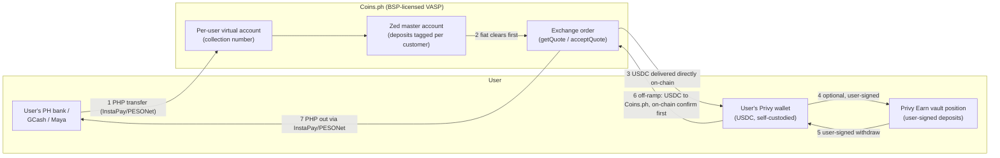

# Zed USDC Dollar Wallet — Product Requirements Document (Track C)

**Status:** Draft v0.1 — skeleton + settled facts only; **open decisions flagged `OPEN` for joint resolution with Steve** (none silently assumed).
**Surfaces:** working copy = collaborative Claude Doc (claude.ai/code/artifact/0bd0af8e-52f1-4d22-9d88-4251da290eac — comment/edit there); team snapshots published to Google Docs per release (first: docs.google.com/document/d/1oFJqp9EvfPh6EjNZdEFN83EYfyrlOASTNPOXt7sMgeg, 2026-09-23; team snapshots carry no internal-workflow language per Steve); this repo file mirrors the working copy at meaningful checkpoints for diff review. Product decisions carry IDs `C-D*`, requirements `C-R*`; research/confirmation questions stay in `track.md` (C-Q*), Coins.ph technical questions in `research/coinsph-integration.md` (OQ-*).
**Date:** 2026-09-23
**Product:** USDC store-of-value account with optional onchain-lending yield, for existing Zed cardholders (working name inherits the "Dollar Wallet" frame — naming is C-D9/OPEN)
**Relationship to the incumbent:** this is Track C of the parallel exploration (`../TRACKS.md`). It reuses the incumbent PRD's regulatory posture where the same logic applies (self-custody, no Zed crypto custody, terminology discipline) and replaces the Bridge/OUSD stack with Coins.ph + USDC + Privy Earn.

**Changelog v0.1 (2026-09-23):** Initial draft from: the Coins.ph integration thread (see `research/coinsph-integration.md` + `SOURCES.md`), the Privy Earn research (`research/privy-earn.md`, `privy-tech-docs.md`), the onchain-lending explainer/decision doc (Google-exported Claude Doc, C-Q15 deliverable), and Steve's 9/23 direction (Coins.ph onramp → self-custodied Privy wallet → Privy vault yield; TMMFs as an exploratory side option given SRC §8 concern).

---

## 1. Summary

Zed offers Philippine customers a dollar-denominated account holding **USDC (Circle's dollar stablecoin)** in a **genuinely user-owned, self-custodied Privy wallet**, with an optional **yield feature powered by Privy Earn** (deposits into a curated onchain lending vault). The regulated PHP↔crypto exchange leg is performed by **Coins.ph, a BSP-licensed VASP**, as principal: users on-ramp by paying PHP into a per-user virtual account, and Coins.ph converts and **delivers USDC directly to the user's Privy address** as part of the same order — Zed never takes custody of user crypto. This is the "rent the license" architecture: the licensed party does the licensed thing, Zed provides the product, wallet software, and distribution.

**Why this track:** no Bridge/OUSD/Open Standard dependency (hedges the incumbent's largest external risk); the exchange leg sits with a domestically licensed VASP rather than an offshore counterparty; yield economics are Zed-configurable (vault fee share) rather than issuer-set. **What it gives up:** the OUSD Marketing Fee + equity programs, and it inherits DeFi-lending risk characterization questions instead.

## 2. The funds flow (settled shape)

Key structural facts (per Coins.ph, 9/14–9/16 — details in `research/coinsph-integration.md`):
- Sequenced settlement both directions (fiat clears → crypto sends; crypto confirms → PHP releases). No Zed float in the crypto leg.
- PHP transits **Zed's master account at Coins.ph** (tagged per customer) → there IS Zed-controlled fiat at the Coins layer → ledger/recon obligations (C-R7).
- No per-user balance API at Coins.ph — consistent with our model: **the chain is the source of truth for user balances**.

## 3. Decisions

### Settled (grounded in discussion to date)

| # | Decision | Choice | Source/basis |
|---|---|---|---|
| C-D1 | Product core | USDC store-of-value account + **optional** yield via onchain lending; no payments/spend in MVP | Steve 9/23; mirrors incumbent D1 scope discipline |
| C-D2 | Stablecoin | **USDC** | Steve 9/23; Coins.ph supports USDC/PHP live today; Privy Earn USDC vaults self-serve |
| C-D3 | Custody | User-owned, self-custodied Privy wallet; open-loop; no Zed signer/keys; all outbound user-signed | Steve 9/23 ("so self custodied"); carries incumbent D3/R31/R32 posture; config confirmations = C-PR-1..5 |
| C-D4 | On-ramp | **Coins.ph VASP partnership**: `merchantCreateUser` (Persona data pass-through) → per-user VA → user pays PHP → exchange order delivers USDC **directly to the user's Privy address** | Steve 9/23 + Coins.ph thread; KYC-mode + mechanics details OPEN (C-D10, OQ-1/3) |
| C-D5 | Yield mechanism | **Privy Earn** vault deposits, user-authorized (wallet-action authorization signature), from the user's own wallet | Steve 9/23 ("built in Privy functionality (i.e. vault)"); signing model per `privy-tech-docs.md` |
| C-D6 | Off-ramp | Reverse Coins.ph flow: user sends USDC (user-signed) → on-chain confirmation → PHP to user via InstaPay/PESONet | Coins.ph recap; API detail pending (OQ-4) |

### Proposed defaults (carried from incumbent conventions — say the word to change)

| # | Decision | Proposed default | Note |
|---|---|---|---|
| C-D7 | Client surface | Mobile-responsive web app in the existing app webview (incumbent D7), JWT/OIDC bring-your-own-auth into Privy | Not yet discussed for Track C; D7 rationale carries; JWT auth per `privy-tech-docs.md` |
| C-D8 | Backend home | Bounded module in `zed-rust-api` (incumbent D8 pattern) | Note: existing production Coins.ph client exists for card payments — evaluate reuse vs. isolate; old D8 caution applied to legacy code |

### OPEN — to work through together (my read + suggestion where I have one; nothing decided)

| # | Decision | The question | Suggestion (flagged, not assumed) |
|---|---|---|---|
| C-D9 | Naming/branding | What users see; how prominently USDC/Circle is disclosed | Inherit "Dollar Wallet" frame + D12-style terminology discipline; needs your call + compliance floor |
| C-D10 | KYC mode | Merchant-hosted (Persona pass-through) vs. hosted Ramp widget (full Coins KYC) | Merchant-hosted, clearly — now with eyes open: the V2 spec confirms a **required Coins H5 verification step** (`redirectUrl`; MPIN lives there). Decision refines to: embed the H5 page in our webview and design around it (refined OQ-1: what's on it, can it be minimized) |
| C-D11 | Yield enrollment model | Auto-enroll all balances vs. account-level opt-in toggle vs. per-deposit choice | I lean **explicit opt-in, default off** at pilot: cleanest consent/disclosure story for a yield product with loss risk, and it separates the wallet's regulatory posture from Earn's. Costs adoption. Your call — this is the biggest pure-product decision here |
| C-D12 | Vault venue | Confirm Option A (single Morpho Prime USDC vault) from the lending doc; then Gauntlet vs. Steakhouse | Your comment on the lending doc is still open; venue choice should follow the curator-diligence memo, not the APY print |
| C-D13 | Fee share / user rate | Zed's cut of vault yield (Morpho allows ≤50%) | The positioning dial: at ~4.4% gross, 25% share → user ~3.3% (vs. incumbent's ~3.75% gross Marketing-Fee comparison). Model both before setting |
| C-D14 | On-ramp UX shape | Quote-first (user states USDC target, pays exact PHP) vs. deposit-first (any PHP in, convert on arrival) | Depends on OQ-3 (quote validity vs. bank-transfer timing). Deposit-first is more forgiving UX; quote-first is more precise. Hold until Coins.ph answers |
| C-D15 | Pilot scope/eligibility/limits | Reuse incumbent's frame (50 invite-only cardholders, similar caps)? | Propose reuse for comparability across tracks; not yet discussed |
| C-D16 | Chain | Base (vaults are there self-serve; incumbent target chain) | Blocked on OQ-2: confirm Coins.ph delivers USDC on Base |

## 4. Yield side-option under exploration: tokenized money-market funds ("TMMFs")

Held open per Steve (9/23), not in MVP scope. The attraction: Treasury-bill-backed yield, countercyclical to crypto borrowing demand, the easiest risk story to tell a regulator — and reachable through the same Privy Earn API (PathUSD-on-Tempo exists self-serve today; category flagship is BlackRock's BUIDL). **The concern (Steve):** a fund share offered to Philippine retail plausibly triggers **Securities Regulation Code ("SRC") Section 8** — registration required before securities are sold or offered in the Philippines — a heavier lift than the "access to a lending protocol" characterization for DeFi vaults (which has its own open analysis, C-Q12). Status: **exploratory side-track**; gates: counsel opinion (C-Q14/C-LC-10 analog for USDC-track), Privy TMMF availability/eligibility for PH users. If DeFi-vault characterization fails at counsel, TMMF-with-registration becomes the fallback rather than the sidecar.

## 5. Requirements (v0.1 — grounded; numbering leaves room)

**Provisioning & KYC**
- C-R1. Onboarding creates: Privy wallet (user-sole-owner config), Coins.ph user via the create-customer V2 API from Persona-held data + captured device context (customerIp/source/userAgent are required fields), and per-user VA — in one session where possible. The **Coins H5 verification page** (`redirectUrl` in the create-customer response) is a designed step in the flow, not an error path: presented in-app, with defined handling for the 10-minute MPIN timeout ("Failed") and abandonment ("Cancelled"). All five KYC webhook statuses map to defined product states; Rejected/Failed alert ops with a user-facing "in review" state.
- C-R1a *(revised 9/23 after backend verification — Zed already collects most of this)*. **Mapping from existing Zed data:** employment → onboarding `employment_type` enum (Consultant/EmployeePrivateSector/Student/Unemployed/Retired/EmployeeGovernment/BusinessOwner/Freelancer; needs mapping table to Coins' EmploymentStatusEnum — values differ, e.g. `self_e`, `covered_service`); `source_of_funds`, `industry`, `employer` (→companyName), `job_function` (→jobTitle), `citizenship` (→nationality), `place_of_birth` (→countryOfBirth — **verify stored format is country, not city**) all in `user_profile_changelog`. **Device context:** capture live from the requesting session at create-customer time (IP + user-agent from the request; platform from `devices` Ios/Android) — precedent: `device_events` logs `ip_address` NOT NULL per login. **Remaining net-new:** `purposeOfAccount` (likely a programmatic constant, e.g. `crypto` — confirm with Coins.ph); enum mapping tables (OQ-9); AMLC-certificate path for `covered_service` (rare — possibly a pilot eligibility exclusion; decisions session).
- C-R2. Coins.ph dedup case (existing `coinsUserId` returned for users who already have Coins accounts) is handled as a first-class path, not an error.
- C-R3. Consents recorded (Zed terms, Privy terms, Coins.ph terms as applicable, yield-feature terms separately if C-D11 = opt-in).

**Money movement**
- C-R4. Every on-ramp records: PHP in (cash-in webhook), order/quote refs, rate applied by Coins.ph, USDC delivered, destination address, tx hash — reconcilable end to end.
- C-R5. Per-operation state machines with immutable event trails; terminal states only completed/refunded/failed-with-ops-resolution (incumbent R24 pattern).
- C-R6. Unmatched/failed/stuck orders alert ops; refund-to-source is the default remedy (path to be confirmed with Coins.ph — OQ-3).
- C-R7. Double-entry ledger over Zed-controlled funds at the Coins.ph layer (master-account balances in transit); user balances are NOT ledger liabilities — on-chain is the source of truth (incumbent R22/R23 pattern). Daily recon: ledger vs. Coins.ph order records vs. on-chain deliveries vs. Privy balance/webhook data.
- C-R8. Coins.ph webhooks verified/idempotent (details OQ-6).

**Custody & yield**
- C-R9. No Zed signer/key on user wallets at any time; all outbound transactions (vault deposits, withdrawals, off-ramp sends) carry the user's authorization signature (incumbent R31 analog; verify config per C-PR-1/2 + sandbox).
- C-R10. Vault deposits/withdrawals only via the user-authorized Earn wallet actions; **no pooling, no Zed omnibus position**.
- C-R11. Zed's Earn fee share accrues to a dedicated Zed admin wallet governed by Privy key-quorum manual approvals (dual control = incumbent R19, enforced in-platform).
- C-R12. Yield display: variable, never "interest" or guaranteed APY; loss-possible and withdrawal-timing disclosures per the lending doc's Part III.5/IV language (terminology discipline = incumbent D12 analog).

**Gates before external users (carry-overs + new)**
- C-R13. Philippine availability of Privy Earn confirmed in writing (C-Q6 — still the threshold item).
- C-R14. Counsel: DeFi-yield-to-retail characterization (C-Q12); Coins.ph-partnership legal shape incl. whose order the exchange is (C-Q10/OQ-8); TMMF/SRC §8 only if pursued.
- C-R15. Vault diligence memo on the chosen venue (market list, oracle configs, curator record) — C-Q15 doc's gate.
- C-R16. Runbooks: stuck order, Coins.ph outage, Privy outage, vault liquidity crunch ("withdraw anytime" footnote scenario), pilot halt with off-ramp priority.

## 6. Open questions ledger (pointers, not duplicates)

Technical (Coins.ph): OQ-1..8 in `research/coinsph-integration.md`. Partner/legal confirmations: C-Q6, C-Q10, C-Q12, C-Q14, C-PR-1..5 (tracker). Product: C-D9..C-D16 above. Research: C-Q15 (Morpho stress deep-dive) feeding C-R15.

## 7. Next steps

1. Steve + Claude resolve C-D10..C-D14 (the real product-shape decisions) — working session or async through this doc.
2. Send OQ-1..8 to Coins.ph tech contacts (symona.wang/ray.li/winona.ingco); get the Create-Customer PDF into the inbox.
3. Sandbox: exercise `merchantCreateUser` + VA creation in Coins.ph test env; verify Earn deposit signing in Privy sandbox (C-Q4 residual).
4. Ask Privy in writing: PH eligibility for Earn (C-Q6).
