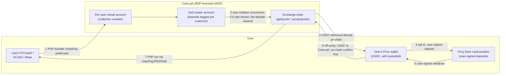

# Zed USDC Dollar Wallet — Product Requirements Document

**Status:** Draft v0.2 (2026-09-23, post design-intro call) — settled facts only; decisions marked `OPEN` are for joint resolution (none silently assumed). Written as a **standalone product proposal** (no cross-track framing, per Steve 9/23).
**Surfaces:** working copy = collaborative Claude Doc (claude.ai/code/artifact/0bd0af8e-52f1-4d22-9d88-4251da290eac); team snapshots published to Google Docs per release (current: docs.google.com/document/d/1TsDvL4Rav9CF3ugRIy-GphyAMdsGk7MZcO4P6AYimSQ, v0.2 2026-09-23); this repo file mirrors the working copy at checkpoints. Team snapshots carry no internal-workflow language.
**IDs:** product decisions `C-D*`, requirements `C-R*`; research questions (C-Q*) and Coins.ph technical questions (OQ-*) tracked separately.

**Changelog v0.2 (2026-09-23):** design-intro call (Granola notes → SOURCES.md) settled **C-D11 (yield = opt-in)** and **C-D14 (two-step deposit flow, FX rate shown at conversion)**; set the product priority ladder (USD acquisition must-have · yield stretch · QR payments out of pilot); InstaPay-first rail preference; TMMFs elevated to the design team's preferred yield alternative pending the SRC §8 question (now design-blocking); positioning principles added; standalone-ized (all cross-track references removed). New follow-ups: Wise deposit-flow reference screenshots; Andy design session; OQ-10.
**Changelog v0.1 (2026-09-23):** initial draft from the Coins.ph integration thread + Create-Customer V2 spec, the Privy Earn research, the onchain-lending analysis, and Steve's direction (Coins.ph onramp → self-custodied Privy wallet → Privy vault yield; TMMFs exploratory given SRC §8).

---

## 1. Summary

Zed offers Philippine customers a dollar-denominated account holding **USDC** in a **genuinely user-owned, self-custodied Privy wallet**, with an optional **yield feature powered by Privy Earn** (deposits into a curated onchain lending vault). The regulated PHP↔crypto exchange leg is performed by **Coins.ph, a BSP-licensed VASP**, as principal: users on-ramp by paying PHP into a per-user virtual account, and Coins.ph converts and **delivers USDC directly to the user's Privy address** as part of the same order — Zed never takes custody of user crypto. This is the "rent the license" architecture: the licensed party does the licensed thing; Zed provides the product, the wallet software, and the distribution. (Working name: "Dollar Wallet" — final naming is C-D9.)

**Why this architecture:** the exchange leg sits with a domestically licensed VASP rather than an offshore counterparty; yield economics are Zed-configurable (vault fee share) rather than issuer-set. Trade-off: yield derives from onchain lending markets, inheriting decentralized-finance ("DeFi") characterization questions addressed in §§4–5 — handled under the same posture discipline as Zed's other stablecoin work: no customer fiat balances on Zed's books; no "deposit," "interest," or customer-FX framing.

### 1.1 Problems we're solving for the user

1. **Make it easy to acquire USD (or a proxy).** Philippine users have no simple way to hold dollars. *Our answer:* PHP in from their bank, GCash or Maya → Coins.ph converts → USDC lands in their own wallet (C-D4, C-D14).
2. **Earn a meaningful yield on a USD-denominated balance.** *Our answer:* optional Privy Earn vault deposits, variable and loss-possible (C-D5, C-D11, C-D13). Tokenized money-market funds remain a side option (§4).
3. **Spend a USD-denominated balance via QR Ph.** *Not yet discussed; outside MVP scope (C-D1: no payments or spend).* Listed so it shapes the architecture now (e.g. whether an off-ramp at the point of sale is fast enough), without committing to it for the pilot.

Priority order (design intro, 9/23): **#1 must-have · #2 stretch · #3 out of pilot** — ship #1 alone if time-constrained; the pilot validates demand, not the forever product. Positioning principles: **"preserve wealth" over "grow savings"** (peso-depreciation framing); never present yield in isolation (6% on pesos net of ~10% currency loss is worse than 4% on USD); design for the literacy gap (users may not know or fully trust USDC vs. a USD bank account).

## 2. The funds flow (settled shape)

Key structural facts (source: [the Coins.ph Slack thread, 9/14–16](https://zedfinancial.slack.com/archives/C09HS2FTGTG/p1789436387222499) + their Create-Customer V2 spec; per-fact attribution in `research/coinsph-integration.md`):
- **Two-step deposit (C-D14, settled 9/23):** PHP lands and clears first; the user then initiates conversion with the FX rate shown at that moment — avoiding rate lock-in and fiat-clearing timing risk, and creating a user-visible PHP-pending state (C-R4a). Once initiated, conversion and on-chain delivery are **one bundled Coins.ph order** (their 9/15 description — no intermediate USDC custody stop; convert-then-hold optionality → OQ-11).
- Sequenced settlement in both directions (fiat clears → crypto sends; crypto confirms on-chain → PHP releases). No Zed float in the crypto leg.
- PHP transits **Zed's master account at Coins.ph** (tagged per customer) → Zed-controlled fiat at the Coins layer → ledger/recon obligations (C-R7).
- No per-user balance API — **the chain is the source of truth for user balances**.

## 3. Decisions

### 3.1 Settled

| # | Decision | Choice | Basis |
|---|---|---|---|
| C-D1 | Product core | USDC store-of-value account + **optional** yield; no payments/spend in MVP (priority ladder: §1.1) | Store-of-value-only scope discipline at launch |
| C-D2 | Stablecoin | **USDC** | Coins.ph supports USDC/PHP live; Privy Earn USDC vaults self-serve |
| C-D3 | Custody | User-owned, self-custodied Privy wallet; open-loop; no Zed signer/keys; all outbound user-signed | No-unilateral-Zed-signing posture; Privy config confirmations pending (C-PR-1..5) |
| C-D4 | On-ramp | **Coins.ph VASP partnership**: create-customer (Persona pass-through) → per-user VA → user pays PHP → exchange order delivers USDC **directly to the user's Privy address**. **InstaPay preferred over PESONet for MVP** (settlement lag + 1–2% intraday FX risk — 9/23) | Coins.ph thread + V2 spec; KYC details → C-D10, OQ-1/3 |
| C-D5 | Yield mechanism | **Privy Earn** vault deposits, user-authorized from the user's own wallet | Signing model per Privy tech docs |
| C-D6 | Off-ramp | Reverse Coins.ph flow: user-signed USDC → on-chain confirmation → PHP via InstaPay/PESONet | Coins.ph recap; detail pending (OQ-4) |
| C-D11 | Yield enrollment | **Opt-in (settled 9/23, design intro):** users intentionally move funds into the vault; base account holds plain USDC with no vault risk | Consent/disclosure UX to be designed (Andy session) |
| C-D14 | On-ramp UX | **Two-step deposit flow (settled 9/23)** — mechanics and rationale in §2. Persistent FX tracker deferred from MVP | Wise deposit flow = UX reference; mechanics → OQ-10/OQ-11 |

### 3.2 Proposed defaults

| # | Decision | Proposed default | Note |
|---|---|---|---|
| C-D7 | Client surface | Mobile-responsive web app in the existing app webview; JWT/OIDC bring-your-own-auth into Privy | Webview keeps daily deploy cadence, no app-store cycle |
| C-D8 | Backend home | Bounded module in `zed-rust-api` (own tables/routes, feature-flagged) | Existing production Coins.ph client (card payments) — evaluate reuse vs. isolate |

### 3.3 OPEN — remaining

| # | Decision | The question | Preliminary suggestion |
|---|---|---|---|
| C-D9 | Naming/branding | What users see; USDC/Circle disclosure prominence | Inherit "Dollar Wallet" frame + terminology discipline; Steve's call + compliance floor |
| C-D10 | KYC mode | Merchant-hosted vs. hosted Ramp widget | Merchant-hosted, with the required Coins H5 verification step embedded in our webview (OQ-1: what's on it, can it be minimized) |
| C-D12 | Vault venue | Confirm single-Morpho-Prime-vault lean; then Gauntlet vs. Steakhouse | Follow the curator-diligence memo, not the APY print |
| C-D13 | Fee share / user rate | Zed's cut of vault yield (Morpho ≤50%) | At ~4.4% gross, 25% share → user ~3.3%. Model competitive positioning before setting |
| C-D15 | Pilot cohort and limits (proposed: 50 invite-only existing cardholders, conservative caps) | — | Not yet discussed; proposal as stated |
| C-D16 | Chain | Base (Earn USDC vaults available self-serve on Base) | Blocked on OQ-2: Coins.ph USDC delivery on Base |

## 4. Yield side-option under exploration: tokenized money-market funds ("TMMFs")

Held open, not in MVP scope — **and elevated at the 9/23 design intro: the design team's preferred yield alternative** if the regulatory question clears; **the Section 8 status must be resolved BEFORE the yield flow is designed** (now design-blocking, not just launch-gating). The attraction: Treasury-bill-backed yield (~3–4%), countercyclical, less speculative, easiest regulator story — reachable via the same Privy Earn API. **The concern:** a fund share offered to Philippine retail plausibly triggers **SRC Section 8** (registration before securities are sold/offered in the PH) — "Zed Invest territory." **Gates:** counsel opinion; Privy TMMF availability/eligibility for PH users. If DeFi-vault characterization fails at counsel, TMMF-with-registration becomes the fallback rather than the sidecar.

## 5. Requirements

**Provisioning & KYC**
- C-R1. Onboarding creates: Privy wallet (user-sole-owner config), Coins.ph user via create-customer V2 (Persona data + live-captured device context: IP/source/user-agent), per-user VA — one session where possible. The Coins H5 verification page is a designed in-app step with defined handling for MPIN timeout ("Failed") and abandonment ("Cancelled"). All five KYC webhook statuses map to product states; Rejected/Failed alert ops with a user-facing "in review" state.
- C-R1a *(backend-verified 9/23)*. Field mapping from existing Zed data: `employment_type` enum (needs mapping table to Coins' EmploymentStatusEnum); `source_of_funds`, `industry`, `employer`→companyName, `job_function`→jobTitle, `citizenship`→nationality, `place_of_birth`→countryOfBirth (**verify format: country, not city**) — all in `user_profile_changelog`. Device context captured live from the requesting session. Net-new: `purposeOfAccount` (likely programmatic constant — confirm), enum mapping tables (OQ-9), AMLC-cert path for covered_service (rare — possible pilot exclusion).
- C-R2. Coins.ph dedup (existing `coinsUserId` on phone+email+name+DOB match) is a first-class path.
- C-R3. Consents recorded; yield-feature terms separate (C-D11 = opt-in).

**Money movement**
- C-R4. Every on-ramp records: PHP in (cash-in webhook), order/quote refs, applied rate, USDC delivered, destination address, tx hash — reconcilable end to end.
- C-R4a *(new v0.2)*. The two-step flow introduces a **user-visible PHP-pending state** (funds received, awaiting user-initiated conversion): displayed clearly, with the FX rate shown at conversion time and nudges for stale un-converted balances (policy → OQ-10).
- C-R5. Per-operation state machines; terminal states only completed/refunded/failed-with-ops-resolution.
- C-R6. Unmatched/failed/stuck orders alert ops; refund-to-source default (confirm path — OQ-3).
- C-R7. Double-entry ledger over Zed-controlled funds at the Coins.ph layer; user balances NOT ledger liabilities — on-chain is source of truth. Daily recon: ledger vs. Coins.ph orders vs. on-chain deliveries vs. Privy data.
- C-R8. Webhooks verified/idempotent (HMAC known for create-customer; rest → OQ-6).

**Custody & yield**
- C-R9. No Zed signer/key on user wallets; all outbound transactions user-signed (verify config per C-PR-1/2 + sandbox).
- C-R10. Vault ops only via user-authorized Earn wallet actions; no pooling, no Zed omnibus position.
- C-R11. Zed's Earn fee share → dedicated Zed admin wallet under Privy key-quorum manual approvals (dual control in-platform).
- C-R12. Yield display: variable, never "interest"/guaranteed APY; loss-possible + withdrawal-timing disclosures; comparative framing per positioning principles (never yield-in-isolation).

**Gates before external users**
- C-R13. Philippine availability of Privy Earn confirmed in writing (C-Q6 — threshold item).
- C-R14. Counsel: DeFi-yield-to-retail characterization (C-Q12); Coins.ph-partnership legal shape incl. whose order the exchange is (C-Q10/OQ-8); **TMMF/SRC §8 — now design-blocking (9/23)**.
- C-R15. Vault diligence memo on chosen venue.
- C-R16. Runbooks: stuck order, Coins.ph outage, Privy outage, vault liquidity crunch, pilot halt with off-ramp priority.

## 6. Open items & next steps

Reference ledgers: Coins.ph technical = OQ-1..11 (integration doc) · partner/legal = C-Q6, C-Q10, C-Q12, C-Q14, C-PR-1..5 (counterparty tracker) · product = C-D9/10/12/13/15/16 · research = C-Q15 (→ C-R15).

1. Resolve remaining decisions C-D9/C-D10/C-D12/C-D13/C-D15/C-D16; Andy design follow-up covers the UX-blocking subset.
2. Send OQ-1..11 to Coins.ph technical contacts (incl. OQ-10 two-step mechanics, OQ-11 delivery-model optionality).
3. Sandbox: create-customer + VA creation in Coins.ph test env; Earn deposit signing in Privy sandbox.
4. Privy in writing: PH eligibility for Earn (C-Q6). Counsel: TMMF/SRC §8 before yield-flow design. Collect Wise deposit-flow screenshots (two-step "I've sent funds" UX reference).
