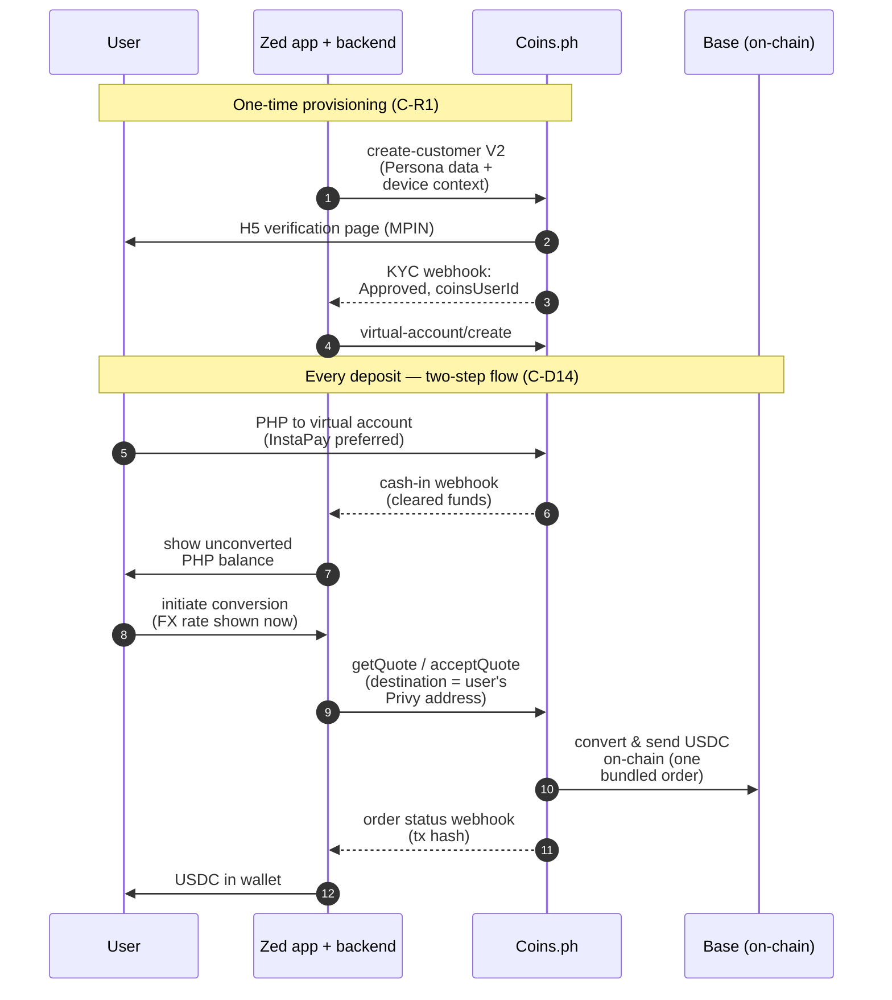

# Coins.ph integration — technical doc

**Status:** v1 (2026-09-23), from the `#coins-ph-zed` Slack thread (9/14–9/21 call recap + Q&A; permalink in `SOURCES.md`). Statements below are Coins.ph's own (lara.tan, shawn.dong) unless marked otherwise. **Test environment is already callable on Zed's account** (shawn.dong, 9/17). Coins.ph's stated integration timeline: **live within ~2 weeks** if resourced (lara.tan, 9/15).

## Relationship & contacts
- Commercial: lara.tan, william.wang, ellie. Technical: shawn.dong, symona.wang, ray.li, winona.ingco (looped in 9/15 for integration questions).
- Context: Zed already uses Coins.ph in production today for USDC **card payments** (internal-only usage; see DEV-7525 and Pete's hardening project, #engineering 9/8). That existing integration is card-domain — this doc covers the *new* ramp integration for the Dollar Wallet. The old D8 caution (Coins.ph API code not trusted as a foundation) applies to our legacy client code, not to their institutional capability.

## The API surface (as described; VERIFIED against their docs = pending)
| Piece | What it does | Notes |
|---|---|---|
| `merchantCreateUser` = `POST openapi/v2/account/kyc/create-customer` | Creates the end user in Coins' system from KYC data Zed already holds → returns `coinsUserId` + **`redirectUrl` (required: "H5 verification page URL")** | Full spec processed 9/23 ("Create Customer API Documentation (V2).pdf", now in `inbox/processed/`) — see "Create-customer spec detail" section below. Coins does NOT re-verify documents (Persona KYC accepted); they run their own sanctions/watchlist screening on top |
| KYC result webhook | Returns one of five statuses: **Approved** (→ `coinsUserId`), **Rejected** (failed risk screening), **Failed** (system error, or user didn't set MPIN within 10 minutes), **Cancelled** (user backed out), **Pending** | ⚠️ The MPIN and "user backed out" language implies *some* end-user interaction even in the merchant-hosted flow — contradicts "users don't see a Coins login or KYC screen." **Open question OQ-1 below** |
| Dedup behavior | If phone + email + name + DOB match an existing Coins user, no new registration — the existing `coinsUserId` is returned | Affects users who already have personal Coins.ph accounts — likely common in PH. Implications for support flows + data mapping |
| `virtual-account/create` | Opens a per-user virtual account (collection number) against a `coinsUserId` | VA = unique identifier mapped to **Zed's single master account**; the VA itself holds no balance; deposits land in the master account, tagged per customer |
| Cash-in webhook | Fires when funds hit a VA | Same "cash in webhook" family as their standard flow |
| `getQuote` / `acceptQuote` | The exchange order: PHP amount in, target crypto, **destination wallet address + chain** | **Key fact: crypto is delivered directly to the specified external wallet as part of the order — "no separate step to release or withdraw it." PHP clears → conversion → USDC lands at the user's Privy address automatically** |
| Docs | api.docs.coins.ph/reference/virtual-account | Public reference for the VA APIs |

## Create-customer spec detail (from the V2 PDF, processed 9/23)
- **Transport:** single `multipart/form-data` POST; parts: `createUserReq` (JSON), `frontIdImage` (required, jpg/png/jpeg ≤2MB), `facePhoto` (required selfie ≤2MB), `backIdImage` (optional), `amlcCertificateImage` (optional — **required when `employmentStatus` = `covered_service`**, the PH AMLA covered-person case).
- **Auth:** `X-COINS-APIKEY` header + HMAC-SHA256 signature over `recvWindow` + `timestamp` + the raw `createUserReq` JSON, passed as query params; `x-trace-id` header. QA base URL in examples: `api.9001.plqa.coinsxyz.me`. (Part-answers OQ-6 for this endpoint.)
- **Required fields Zed must supply:** requestId (merchant order id), customerId (merchant-side id), email or phone (≥1), **customerIp, customerSource (WEB/IOS/ANDROID), customerUserAgent** (i.e., the *end user's* device context — Zed must capture and pass these through), firstName, lastName, dateOfBirth, countryOfBirth, country, nationality, state, city, street, postalCode, **employmentStatus** (enum; conditionals: employed → industry/companyName/jobTitle; Unemployed → sourceFunds (+description if `other`)), **purposeOfAccount** (`legal` | `crypto` | `both`), image MD5s, businessScenarios.
- **Response:** status (enum), requestId, customerId, `coinsUserId` (after successful registration), **`redirectUrl` (required — H5 verification page)**, rejectionReason.
- **⚠️ Fields Persona likely does NOT hold today:** employmentStatus (+industry/company/title or source-of-funds), purposeOfAccount, possibly countryOfBirth. → Zed's onboarding must collect these (or map from existing underwriting data where lawful) — product requirement C-R1a in the PRD.
- **The H5 page (resolves the OQ-1 contradiction):** a user-facing Coins verification step exists even in the merchant-hosted flow — `redirectUrl` is a required response field, and the MPIN/"backed out" statuses now make sense as outcomes of that page. "No Coins login/KYC screen" = no document re-collection, not zero Coins surface.

## Facts that shape the product
1. **Rails:** PHP clears via InstaPay and PESONet — reaches any participating PH bank or e-wallet, **including GCash and Maya**. End-user on-ramp UX = ordinary bank transfer to the collection number.
2. **Supported assets today: USDC and USDT** against PHP. Chain support for delivery **not yet stated** → OQ-2.
3. **Two KYC modes:** hosted Ramp widget (users go through Coins KYC even if already KYC'd with Zed — bad UX for us) vs. **merchant-hosted** (no Coins login/KYC screens; Zed passes Persona data via `merchantCreateUser`). Merchant-hosted is the obvious fit, subject to OQ-1.
4a. **No pending-deposit state** (established 9/23, Steve + thread review): Coins never described deposits as having a pending state; "fiat must clear before we send crypto" is order-sequencing language, and the cash-in webhook fires when funds *hit* the VA — i.e., it is the first signal, on cleared funds. InstaPay clears near-instantly; batch rails (PESONet) are presumably invisible to Coins until they land. Confirmation + post-webhook recall behavior → OQ-14.
4. **Sequenced settlement, both directions:** "we always confirm the first leg before releasing the second" — on-ramp: fiat must clear before crypto sends; off-ramp: crypto must confirm on-chain before PHP releases. No float, no credit exposure to Coins.ph mid-order — but also **no instant-feel on-ramp unless InstaPay clearing is fast** (it usually is, near-real-time).
5. **No per-user balance API** ("total balance across your users needs to be tracked on your end" — 9/14 recap): transaction-level detail + status via order/webhook APIs only. For USDC this fits our architecture (on-chain = source of truth). **For PHP, the two-step decision (C-D14) makes this load-bearing:** pending PHP sits in the master account indefinitely per user, and the user-visible pending balance has NO external per-user source of truth — it derives solely from Zed's ledger (credits = tagged cash-in webhooks; debits = conversion orders/refunds). → PRD C-R7a: the PHP subledger is a first-class subsystem; recon anchors are order records + the master-account aggregate (OQ-12). Also a counsel item (PRD C-R14): the pending-PHP characterization — user funds at Coins vs. Zed-administered stored value (e-money implications of an open-ended pending window).
6. **PHP lands in Zed's master account** (tagged per customer) before conversion. So there IS Zed-controlled fiat in the flow at the Coins.ph layer → ledger + reconciliation requirements carry over from the incumbent's §6.8 pattern.

## On-ramp flow (as understood — sequence to verify in test env)

1. One-time: `merchantCreateUser` (Persona data) → webhook → `coinsUserId`; `virtual-account/create` → user's collection number.
2. Per deposit: user gets quote (`getQuote`) → pays PHP to their VA from any bank/GCash/Maya → cash-in webhook fires → `acceptQuote` (destination = user's Privy address, chain) → Coins converts and sends USDC on-chain → confirmation via order status/webhook.
   - ⚠️ Exact ordering of quote-vs-deposit and quote validity windows not yet specified → OQ-3.

## Off-ramp flow (thin — needs detail)
Per the recap: crypto confirmed on-chain first, then PHP released. Mechanics (deposit address per user? order-attributed? destination bank registration? InstaPay/PESONet routing; fees) **not yet described** → OQ-4.

## Open technical questions (→ Coins.ph tech contacts)

**Status tracking moved to the PRD §6.2 (Steve, 9/23) — the PRD is the canonical status board; this section keeps the full technical elaboration per question.**
- **OQ-1** *(refined 9/23 — H5 step confirmed by the V2 spec)*: what exactly is on the H5 verification page (MPIN set? liveness? disclosures?), how long does it take, can it be embedded in Zed's webview, and can any of it be suppressed/pre-filled? What does the user see if they return later after "Failed" (10-min MPIN timeout)?
- **OQ-2.** Which chains can USDC be delivered on (Base?), and are there per-chain fees/minimums?
- **OQ-3.** Quote mechanics: validity window, quote-before-or-after deposit, partial/over/under-payment handling, refund path for failed orders.
- **OQ-4.** Off-ramp API detail: how the user's USDC is received (per-user deposit address? order-first?), attribution, PHP payout rails/fees/limits, destination-account registration + name-match support.
- **OQ-5.** Fees and FX spread: where Coins.ph takes economics on the quote, and what's negotiable at volume. Any Zed rev-share?
- **OQ-6.** Webhook auth/signing, retry semantics, idempotency, sandbox↔prod parity.
- **OQ-7.** Limits: per-user/per-txn/daily caps, and whose (Coins') compliance thresholds trigger enhanced review.
- **OQ-14.** Cash-in webhook clearing semantics: confirm the webhook fires only on **cleared** funds (no pre-clearing/"pending deposit" state exists in the API — consistent with the thread; nothing they've said suggests otherwise), and whether a deposit can be recalled/reversed *after* the webhook per rail (InstaPay vs. PESONet), and how such a reversal is signaled. Drives the ledger's cash-in-posts-to-Posted rule (D-L2) and the adjustment path.
- **OQ-13.** Fiat-out for pending PHP: does the merchant API support (a) refunding an un-converted deposit back to its funding source, and/or (b) a user-elected PHP withdrawal to their bank — without converting to crypto? (Their PHP-outbound rails exist for the off-ramp; the question is API access for un-converted deposits. Public docs show a "Transfers" module but no documented fiat cash-out of deposits.) If unsupported: manual/ops path and constraints?
- **OQ-12.** Reconciliation + custody position for the master account: (a) is there an API for the master-account **aggregate balance** and/or periodic statements, and what do they recommend as the recon anchor for deposits-minus-orders? (b) Can Coins attribute pending PHP to the `coinsUserId` on *their* books (vs. tagging only)? (c) **Will Coins confirm in writing that PHP held pending conversion is customer funds held by Coins.ph under its VASP/EMI authority** (Zed acting as interface/recordkeeper)? — supports the C-R4b position; per-user attribution on their books makes it strongest.
- **OQ-11.** Delivery model optionality: is a destination wallet address required on every exchange order, or does a convert-then-hold variant exist (USDC resting in a Coins-side balance pending a separate withdrawal)? If the latter: whose balance — the user's `coinsUserId` or Zed's master account? (Zed's preference is the bundled direct-delivery path regardless: a Zed-attributed resting USDC balance would create the omnibus-custody fact pattern the architecture avoids.)
- **OQ-10.** *(from the 9/23 design decision: two-step deposit flow)* Can PHP deposits sit unconverted in the master account until the user initiates conversion? Any maximum holding period or forced-conversion policy? Is the conversion order independently initiable per tagged deposit? Can rails be constrained/labeled so InstaPay is the default path for MVP?
- **OQ-9.** Full enum tables referenced by the V2 spec but not included: EmploymentStatusEnum, IdTypeEnum, CountryEnum, StatusEnum — needed for the Zed↔Coins field-mapping layer. Also: is `purposeOfAccount` expected per-user or can the merchant set a constant (e.g. `crypto`)?
- **OQ-15** *(raised at the 9/24 design session)*: expired IDs at create-customer — does Coins.ph validate ID expiry on `frontIdImage`? If an expired ID is flagged: which webhook status/rejection reason, and what remediation is accepted (a fresh Persona capture?)? Context: re-running Persona KYC has a real cost, but the BSP obligation to maintain updated customer records may justify it (→ PRD C-R1b).
- **OQ-16** *(raised at the 9/24 design session)*: forced offboarding — can the merchant force-close/offboard a customer created via create-customer (Zed-initiated exit for delinquent or closed card accounts)? Process, notice requirements, and disposition of any unconverted PHP still tagged to that customer (→ PRD C-R17).
- **OQ-8.** Legal shape of the exchange order: is the conversion executed as the *user's* order (coinsUserId-attributed) with Zed as technical facilitator, or as Zed's order? (Feeds counsel question C-Q10 — the answer shapes the whole regulatory characterization.)

## What this closes / feeds
- **C-Q9 (partner model) — substantially answered:** B2B API partnership exists; users become Coins-registered via merchant-hosted KYC pass-through; **third-party wallet delivery is native** (the seam we most worried about). Remaining: OQ-1..8.
- Direct-to-Privy delivery means **Zed never touches the crypto leg** — same no-custody shape as the incumbent architecture's primary-issuance model, with Coins.ph as the licensed exchange principal.
- 2-week integration estimate + live test env → Track C's build timeline is credible for a pilot.
