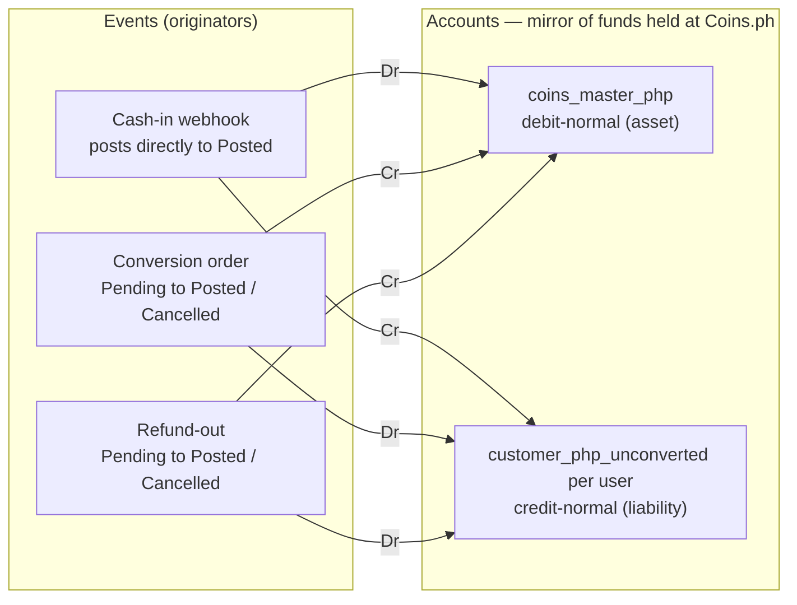
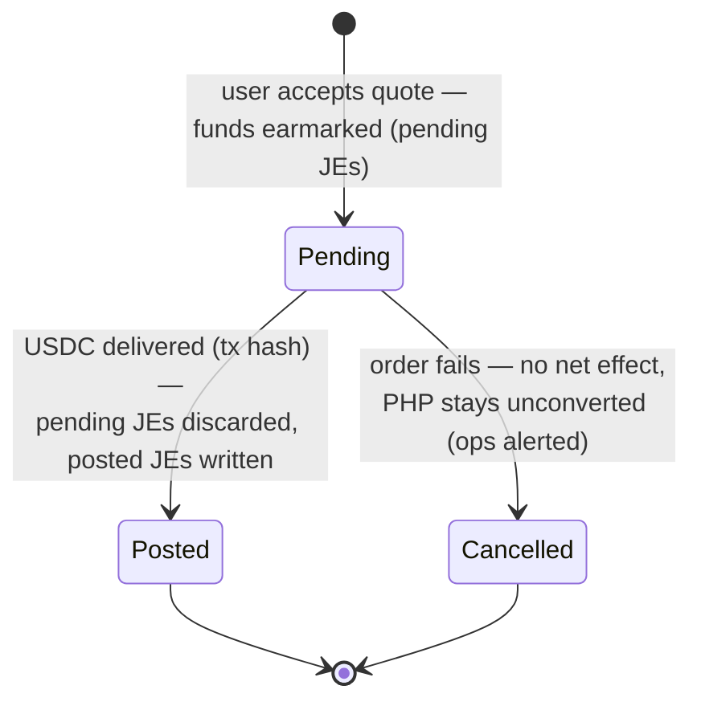

# PHP Pending-Balance Ledger — design v0.1

**Status:** draft for Steve's review, 2026-09-23. Implements PRD C-R7/C-R7a/C-R4b.
**Lineage:** deliberately follows the conventions of Steve's card-product design ("Shadow Ledger Redux," Notion, fetched 9/23 → SOURCES.md): the `Ledger_Accounts` / `Ledger_Transactions` / `Ledger_Entries` triad, credit/debit-normal accounts, Pending→Posted lifecycle via `group_id` + `discarded_at`, cached balances recomputed under row locks, originator tables 1:1 with ledger transactions. Where this design diverges, the divergence is called out with a ❖.

## 0. Why this is the simple case

Compared to the card ledger: **one currency** (PHP centavos — USDC is never ledgered; the chain is its source of truth), **no FX four-account cases**, **no network-message zoo** (two webhook families + one order API), **no revenue accounts** (zero-fee pilot, R29-analog), and **no Zed money in the system at all**. The entire balance sheet is: cash at Coins = customer claims. Assets = Liabilities, with no Equity section — the trial balance nets to zero with two account families.

**Frame (per C-R4b):** this is a *mirror* of funds held at Coins.ph, not a book of Zed's own assets/liabilities. "Asset" below means "cash at Coins attributed to our customers," "liability" means "the customer's claim on it." The mirror must balance internally AND reconcile externally (OQ-12 anchors).

## 1. Chart of accounts

| Account | Normal balance | Cardinality | Meaning |
|---|---|---|---|
| `coins_master_php` | Debit (asset) | 1 | Aggregate customer PHP sitting in Zed's master account at Coins.ph |
| `customer_php_unconverted:{user_id}` | Credit (liability) | per user | That user's cleared-but-unconverted PHP held at Coins (the number the app displays). Named to avoid conflation with rail-clearing 'pending' — no pre-clearing deposit state exists (OQ-14) |

**Invariant I1 (the whole balance sheet):** `coins_master_php.balance == Σ customer_php_unconverted.balance` at every status level (posted and pending views).
**Invariant I2 (per transaction):** Σ debits == Σ credits, single currency.
**Invariant I3 (external):** `coins_master_php.posted_balance == Coins-side aggregate` (recon anchor → OQ-12); per-user balances == Coins `coinsUserId` attribution if OQ-12(b) confirms it exists.

❖ **No clearing/in-flight accounts.** In-flight visibility comes from `status = Pending` transactions on a `group_id`, exactly like a card auth. Alternative considered: explicit `conversion_in_flight` clearing accounts — rejected for v0.1 (adds accounts without adding information; revisit if ops wants in-flight as a balance-sheet line). **← Steve to confirm.**

## 2. Transaction types & originators

| `transaction_type` | Originator table (1:1) | Trigger |
|---|---|---|
| `cash_in` | `coins_cash_in_events` (raw webhook payload, provider event id) | Coins cash-in webhook (deposit tagged to user's VA) |
| `conversion` | `coins_orders` (quote id, order id, rate, destination address, chain, tx hash) | User-initiated conversion (C-D14 step 2) → order lifecycle |
| `refund_out` | `coins_refunds` (mechanism, destination, provider refs) | Refund-to-source (C-R6) or user-requested PHP withdrawal — API support unconfirmed (OQ-13); manual/ops fallback uses identical postings |
| `adjustment` | `ledger_adjustments` (reason, maker, checker) | Dual-approved manual correction (R19-analog) |

Originator rows are the idempotency boundary: `UNIQUE` on provider identifiers (webhook event id, order id, `requestId`) — a replayed webhook inserts nothing.

## 3. Posting rules (worked in the Redux illustration style)

Amounts in centavos. `cust_u1` = `customer_php_unconverted:user_1`.

### Cash-in: user_1 deposits ₱5,000 (webhook = fiat cleared)

Ledger_Transactions
| id | status | transaction_type | group_id | discarded_at | effective_at |
|---|---|---|---|---|---|
| 1 | posted | cash_in | group_1 | null | T1 |

Ledger_Entries
| id | ledger_account_id | ledger_transaction_id | direction | amount | currency |
|---|---|---|---|---|---|
| 1 | coins_master_php | transaction_1 | debit | 500000 | PHP |
| 2 | cust_u1 | transaction_1 | credit | 500000 | PHP |

❖ Cash-in posts **directly to Posted** (no pending stage) — **aligned with Steve 9/23**: Coins has no pre-clearing visibility (the cash-in webhook is the first signal, on cleared funds; InstaPay near-instant, batch rails invisible until landing). Post-webhook recalls, if they exist at all, are handled as `adjustment` (per-rail behavior → OQ-14).

### Conversion: user_1 converts ₱3,000 → USDC (C-D14 step 2)

On acceptQuote (order accepted, in flight) — status Pending, group_2:
| id | ledger_account_id | ledger_transaction_id | direction | amount |
|---|---|---|---|---|
| 3 | cust_u1 | transaction_2 (pending) | debit | 300000 |
| 4 | coins_master_php | transaction_2 (pending) | credit | 300000 |

On order completion webhook (USDC delivered, tx hash recorded on `coins_orders`): discard transaction_2 (`discarded_at = T3`), insert transaction_3 — identical entries, status **Posted**, same group_2.
On order failure: discard transaction_2, insert status **Cancelled** transaction (no net effect); PHP remains in `cust_u1`; ops alerted (C-R6).

The user's displayable balance during flight uses the Redux **`current_balance`** definition (posted increases − posted-and-pending decreases): the ₱3,000 is unavailable the moment they accept the quote — no double-convert race.

### Refund-out: user_1 gets ₱2,000 returned to source

Same shape as conversion: Pending (Dr `cust_u1` / Cr `coins_master_php`) on initiation → Posted on provider confirmation → Cancelled on failure. Identical whether executed via API (if OQ-13 confirms) or manually by ops through Coins' interface (dual-approved; postings entered via `adjustment`-style tooling but typed `refund_out`).

## 4. Schema

Reuse the Redux tables **verbatim** — `Ledger_Accounts` (with `normal_balance`, cached `posted_balance` / `pending_balance` / `current_balance`), `Ledger_Transactions` (status enum Pending/Posted/Cancelled, `transaction_type`, `group_id`, `effective_at`, `discarded_at`), `Ledger_Entries` (`direction`, `amount`, `currency`) — plus the originator tables in §2, inside the wallet module's own schema (PRD C-D8: bounded module).

❖ **Amounts as `BIGINT` minor units (centavos)**, not Decimal — Redux mixes Integer (balances) and Decimal (entries); recommend standardizing on integers here. **← Steve to confirm.**

❖ **Opportunity:** Redux is a design, not yet built. This module could be the **first implementation of the Redux core** — generic `ledger_*` tables in a shared crate, wallet domain as the pilot tenant, cards pointed at it later (satisfies the incumbent's R26 "evaluate shadowledger" the constructive way). Smaller blast radius than debuting the pattern on cards. **← Steve's call; affects where the tables live.**

## 5. Concurrency & correctness (inherited from Redux, unchanged)

- Row-lock the user's `ledger_account` before posting; lock ordering: account row → group rows (`SELECT … FOR UPDATE` on `group_id`) → inserts → balance recompute → release.
- **The Postgres re-evaluation race from the Redux notes applies verbatim** (predicate re-evaluation on locked rows after concurrent commit — Postgres docs §13.2.1): same mitigation — never soft-delete-and-reinsert balance rows; balances live on the account row, updated in place under the lock.
- Discard-then-post on order completion happens in one atomic DB transaction (Redux's "first clearing" note).
- Webhook handlers idempotent via originator uniqueness (§2); out-of-order delivery tolerated (completion before accepted-ack → create-and-post in one step).

## 6. Reconciliation (C-R7a, daily + on-demand)

1. **Aggregate:** `coins_master_php.posted_balance` vs Coins-side master-account figure (mechanism → OQ-12a). Until an aggregate API exists: derived check = Σ(cash-in webhooks) − Σ(completed orders) − Σ(refunds) vs our balance — weaker (events-only), flagged as such.
2. **Per-order:** every `coins_orders` row vs Coins order-status API; every completed order has a tx hash whose on-chain USDC delivery to the user's Privy address is verified (ties into the C-R4 record).
3. **Per-user (if OQ-12b):** `customer_php_unconverted:{u}` vs Coins `coinsUserId` attribution.
4. Any break → paged (C-R7a); unresolved >24h breaches the zero-loss bar.

## 7. Open design questions (for Steve)

1. **D-L1:** Lean model (no clearing accounts, pending-status = in-flight) — confirm, or explicit in-flight accounts?
2. **D-L2:** Cash-in posts straight to Posted — confirm, or model a pending stage for rail-recall risk?
3. **D-L3:** Integer centavos everywhere — confirm the Decimal→BIGINT standardization?
4. **D-L4:** Build as the first implementation of generic Redux core tables (shared later with cards) vs. wallet-local tables?
5. **D-L5 (product):** promoted to PRD decision **C-D17 (HELD, Steve 9/23)** — stale unconverted-PHP policy: auto-refund-to-source after N days vs. nudge-only. The ledger supports either (refund_out postings exist regardless).

## Coins.ph API validation (Steve's question: "transfer it out of Coins")

Two distinct "outs" exist conceptually: (a) **refund of un-converted PHP back to the funding source** — our C-R6 default remedy; (b) **user-elected PHP withdrawal** to their bank. The 9/14 recap confirms Coins runs PHP-outbound rails (InstaPay/PESONet) for the crypto off-ramp, so the capability exists on their side; whether the **merchant API exposes fiat-out for pending PHP** (either flavor) is not visible in their public docs (a "Transfers" module exists; no documented fiat cash-out of un-converted deposits found). → **OQ-13** to their tech contacts. The ledger supports both outcomes: if API-supported, `refund_out` is automated; if not, it's an ops runbook with identical postings.
