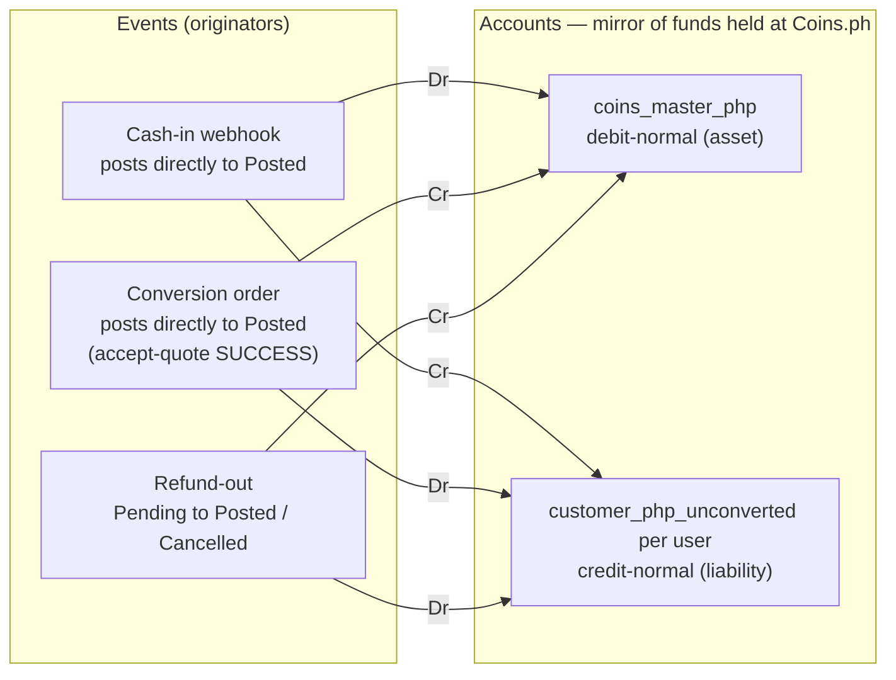
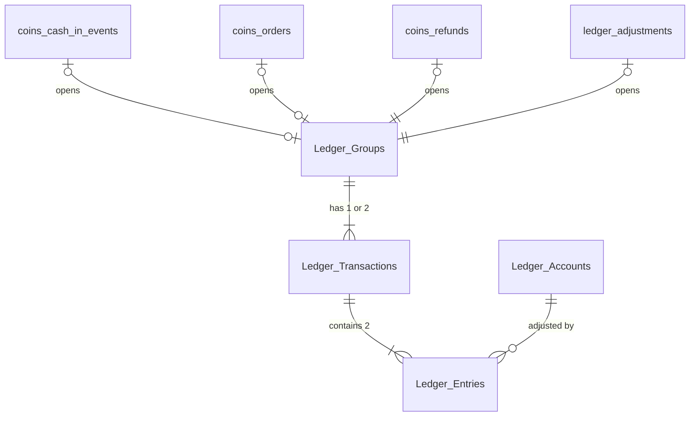
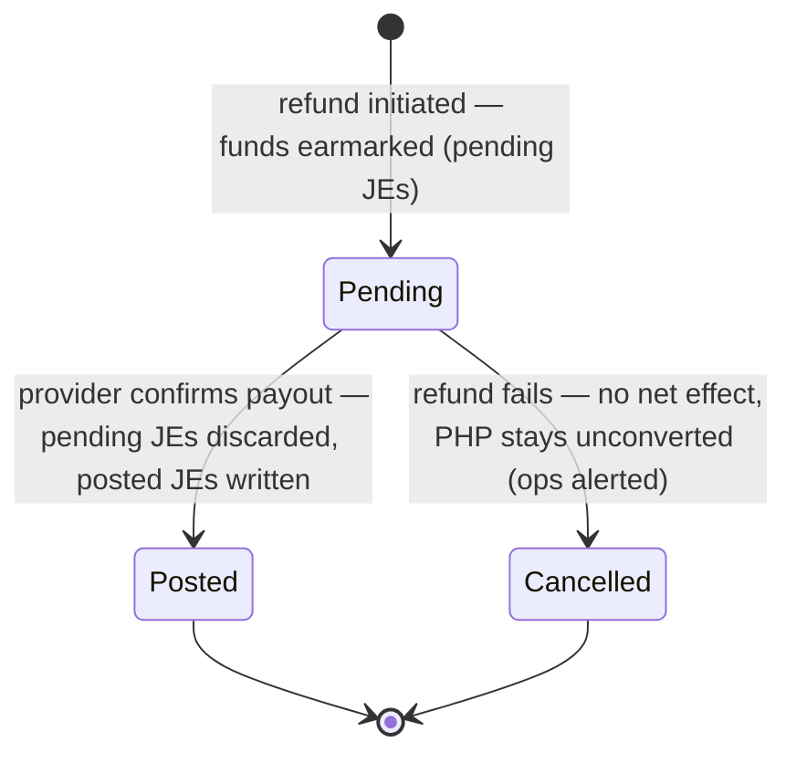

# PHP Pending-Balance Ledger — design v0.1

**Status:** draft, updated 2026-10-02 (no Pending stage for conversions in the MVP, decided 10/02 — post to Posted on the accept-quote **terminal `SUCCESS`**, refined same day from the public REST docs; refund-out keeps the two-step lifecycle — §§1–5, D-L8/D-L10). Implements PRD C-R7/C-R7a/C-R4b.
**Lineage:** deliberately follows the conventions of Steve's card-product design ("Shadow Ledger Redux," Notion, fetched 9/23 → SOURCES.md): the `Ledger_Accounts` / `Ledger_Transactions` / `Ledger_Entries` triad, credit/debit-normal accounts, Pending→Posted lifecycle via `group_id` + `discarded_at`, account-level balance state maintained under row locks, an originator table behind every ledger posting. Where this design diverges, the divergence is called out with a ❖.

## 0. Why this is the simple case

Compared to the card ledger: **one currency** (PHP centavos — USDC is never ledgered; the chain is its source of truth), **no FX four-account cases**, **no network-message zoo** (two webhook families + one order API), **no revenue accounts** (zero-fee pilot, R29-analog), and **no Zed money in the system at all**. The entire balance sheet is: cash at Coins = customer claims. Assets = Liabilities, with no Equity section — the trial balance nets to zero with two account families.

**Frame (per C-R4b):** this is a *mirror* of funds held at Coins.ph, not a book of Zed's own assets/liabilities. "Asset" below means "cash at Coins attributed to our customers," "liability" means "the customer's claim on it." The mirror must balance internally AND reconcile externally (OQ-12 anchors).

## 1. Chart of accounts

| Account | Normal balance | Cardinality | Meaning |
|---|---|---|---|
| `coins_master_php` | Debit (asset) | 1 | Aggregate customer PHP sitting in Zed's master account at Coins.ph |
| `customer_php_unconverted:{user_id}` | Credit (liability) | per user | That user's cleared-but-unconverted PHP held at Coins (the number the app displays). Named to avoid conflation with rail-clearing 'pending' — no pre-clearing deposit state exists (OQ-14) |

**Invariant I1 (the whole balance sheet):** `coins_master_php.balance == Σ customer_php_unconverted.balance` for both `posted_balance` and `pending_balance` (§4.2).
**Invariant I2 (per transaction):** Σ debits == Σ credits, single currency.
**Invariant I3 (external):** `coins_master_php.posted_balance == Coins-side aggregate` (recon anchor → OQ-12); per-user balances == Coins `coinsUserId` attribution if OQ-12(b) confirms it exists.
**Invariant I4 (counters match the journal):** each stored counter (§4.1) equals the sum of that account's journal entries in its bucket (§6.1).


```mermaid
flowchart LR
  subgraph EVENTS["Events (originators)"]
    CI["Cash-in webhook<br/>posts directly to Posted"]
    CV["Conversion order<br/>posts directly to Posted<br/>(accept-quote SUCCESS)"]
    RF["Refund-out<br/>Pending to Posted / Cancelled"]
  end
  subgraph ACCOUNTS["Accounts — mirror of funds held at Coins.ph"]
    MA["coins_master_php<br/>debit-normal (asset)"]
    UP["customer_php_unconverted per user<br/>credit-normal (liability)"]
  end
  CI -->|"Dr"| MA
  CI -->|"Cr"| UP
  CV -->|"Dr"| UP
  CV -->|"Cr"| MA
  RF -->|"Dr"| UP
  RF -->|"Cr"| MA
```

❖ **No clearing/in-flight accounts.** Where in-flight state exists at all (refund-out only — conversions post synchronously, §3), it is carried by `status = Pending` transactions on a `group_id`, exactly like a card auth. Alternative considered: explicit clearing accounts — rejected for v0.1 (adds accounts without adding information; revisit if ops wants in-flight as a balance-sheet line). **← Steve to confirm (D-L1).**

## 2. Tables and schemas

**All eight tables are new.** Four are the Redux core (generic double-entry). Four are wallet-specific *originator* tables: the record of the external event or business object behind each ledger posting. All sit in the wallet module's own schema (PRD C-D8).


```mermaid
erDiagram
  coins_cash_in_events |o--o| Ledger_Groups : opens
  coins_orders |o--o| Ledger_Groups : opens
  coins_refunds |o--|| Ledger_Groups : opens
  ledger_adjustments |o--|| Ledger_Groups : opens
  Ledger_Groups ||--|{ Ledger_Transactions : "has 1 or 2"
  Ledger_Transactions ||--|{ Ledger_Entries : "contains 2"
  Ledger_Accounts ||--o{ Ledger_Entries : "adjusted by"
```

### 2.1 Table inventory

| Table | Kind | One row per |
|---|---|---|
| `Ledger_Accounts` | Core | Account — one `coins_master_php`, plus one per user |
| `Ledger_Groups` | Core | Lifecycle — one cash-in, order, refund, or adjustment |
| `Ledger_Transactions` | Core | Accounting transaction — one or two per group (§2.4) |
| `Ledger_Entries` | Core | Debit or credit line — two per transaction |
| `coins_cash_in_events` | Originator | Cash-in webhook received |
| `coins_orders` | Originator | Conversion order |
| `coins_refunds` | Originator | Refund-out |
| `ledger_adjustments` | Originator | Dual-approved manual correction |

### 2.2 Core ledger tables

Redux's tables, with the changes marked ❖.

**`Ledger_Accounts`**

| Field | Type | Description |
|---|---|---|
| `id` | UUID, primary key | |
| `name` | String, unique | `coins_master_php` or `customer_php_unconverted:{user_id}` |
| `normal_balance` | Enum: `debit` / `credit` | Per the chart of accounts (§1) |
| `posted_debits` | `BIGINT` centavos, ≥ 0 | ❖ Sum of debit entries on active posted transactions (§4.1) |
| `posted_credits` | `BIGINT` centavos, ≥ 0 | ❖ Sum of credit entries on active posted transactions |
| `pending_debits` | `BIGINT` centavos, ≥ 0 | ❖ Sum of debit entries on active pending transactions only |
| `pending_credits` | `BIGINT` centavos, ≥ 0 | ❖ Sum of credit entries on active pending transactions only |
| `lock_version` | `BIGINT` | Optional; incremented on every counter update, so reconciliation can detect a change between reads |
| `created_at`, `updated_at` | Datetime | |

❖ The four counters replace Redux's stored `posted_balance` / `pending_balance` / `current_balance`; balances are derived on read (§4.2). The user-to-account link is not on this table: as in Redux's Customers table, the wallet's per-user record (the one holding `coinsUserId` and the virtual account, C-R1) carries `ledger_account_id`.

**`Ledger_Groups`**

| Field | Type | Description |
|---|---|---|
| `id` | UUID, primary key | The `group_id` that ties a Pending transaction to its replacement |
| `group_type` | Enum: `cash_in` / `conversion` / `refund_out` / `adjustment` | Redux's values are Charge / Payment |
| `created_at` | Datetime | |

**`Ledger_Transactions`**

| Field | Type | Description |
|---|---|---|
| `id` | UUID, primary key | |
| `group_id` | UUID, foreign key → `Ledger_Groups` | Every transaction belongs to a group |
| `status` | Enum: `pending` / `posted` / `cancelled` | Written once at insert, never updated |
| `transaction_type` | Enum: `cash_in` / `conversion` / `refund_out` / `adjustment` | Same value as the group's `group_type` |
| `effective_at` | Datetime | When the event took effect at Coins.ph |
| `discarded_at` | Datetime, nullable | Set once, when a Pending transaction is replaced — the only field updated after insert |
| `created_at` | Datetime | |

Constraint: at most one non-discarded transaction per group (partial unique index on `group_id` where `discarded_at` is null) — a second Posted or Cancelled on the same group cannot be written. Holds while v0.1 replaces each Pending whole, exactly once (D-L7).

**`Ledger_Entries`** — insert-only.

| Field | Type | Description |
|---|---|---|
| `id` | UUID, primary key | |
| `ledger_transaction_id` | UUID, foreign key → `Ledger_Transactions` | |
| `ledger_account_id` | UUID, foreign key → `Ledger_Accounts` | |
| `direction` | Enum: `debit` / `credit` | |
| `amount` | `BIGINT` centavos, > 0 | |
| `currency` | Enum | `PHP` only in v0.1 |
| `created_at` | Datetime | |

### 2.3 Originator tables

Each originator row opens one group and points at it with `group_id`. ❖ Redux's originators (Network_Messages, Payments) point at a single `ledger_transaction_id`; here a refund writes two transactions on one group, so the link is to the group (conversions write one since the 10/02 decision, but keep the same shape). **← Steve to confirm (D-L9).**

Columns marked "Coins.ph" come from its webhooks and API responses. Their field names are not confirmed yet (OQ-6) and get mapped when test-environment payloads are captured.

**`coins_cash_in_events`** — one row per cash-in webhook.

| Field | Type | Description | Source |
|---|---|---|---|
| `id` | UUID, primary key | | Zed |
| `provider_event_id` | String, unique | Idempotency key: a replayed webhook inserts nothing | Coins.ph |
| `virtual_account` | String | Collection number the deposit hit | Coins.ph |
| `user_id` | UUID, foreign key, nullable | Resolved from the virtual account | Zed lookup |
| `amount` | `BIGINT` centavos | | Coins.ph |
| `raw_payload` | JSONB | Full webhook body, including rail and sender details needed for refund-to-source | Coins.ph |
| `received_at` | Datetime | | Zed |
| `group_id` | UUID, foreign key → `Ledger_Groups`, unique, nullable | Null only when the deposit cannot be matched to a user — nothing is posted and ops is alerted (C-R6) | Zed |

**`coins_orders`** — one row per conversion order.

| Field | Type | Description | Source |
|---|---|---|---|
| `id` | UUID, primary key | | Zed |
| `user_id` | UUID, foreign key | | Zed |
| `request_id` | String, unique | Idempotency key Zed sends with the order (`requestId`) | Zed |
| `quote_id` | String | The quote the user accepted | Coins.ph `getQuote` |
| `coins_order_id` | String, unique, nullable | Null until Coins.ph returns it | Coins.ph `acceptQuote` |
| `php_amount` | `BIGINT` centavos | Amount earmarked and converted | User input |
| `usdc_amount` | `BIGINT`, USDC base units (6 decimals) | Quoted USDC amount; delivery is verified on-chain in reconciliation (§6.2) | Coins.ph |
| `rate` | Decimal | PHP per USDC shown to the user at conversion (C-D14) | Coins.ph `getQuote` |
| `destination_address` | String | The user's Privy wallet address | Zed (Privy) |
| `chain` | Enum | Delivery chain (OQ-2) | Zed |
| `tx_hash` | String, nullable | On-chain delivery transaction | Coins.ph order webhook |
| `status` | Enum: `initiated` / `completed` / `failed` | `initiated` = row written before calling `acceptQuote`; stays `initiated` through a rare TODO/PROCESSING response (the in-flight guard, §5); `completed` = terminal SUCCESS, Posted written; `failed` = decline or terminal FAILED, no ledger rows (C-R5) | Zed |
| `raw_payload` | JSONB | Latest order-status body | Coins.ph |
| `group_id` | UUID, foreign key → `Ledger_Groups`, unique, nullable | Null until terminal SUCCESS — set when the Posted transaction is written; stays null on `failed` orders (no ledger rows) | Zed |
| `created_at`, `updated_at` | Datetime | | Zed |

Constraint: at most one `initiated` order per user (partial unique index on `user_id` where `status = 'initiated'`) — the double-convert guard now that conversions carry no ledger hold (§5).

**`coins_refunds`** — one row per refund-out.

| Field | Type | Description | Source |
|---|---|---|---|
| `id` | UUID, primary key | | Zed |
| `user_id` | UUID, foreign key | | Zed |
| `refund_type` | Enum: `refund_to_source` / `user_withdrawal` | C-R6 remedy, or user-requested PHP withdrawal | Zed |
| `mechanism` | Enum: `api` / `manual` | API if Coins.ph supports it (OQ-13); otherwise ops through Coins.ph's interface | Zed |
| `amount` | `BIGINT` centavos | | Zed |
| `destination` | JSONB | Bank or e-wallet account the PHP returns to | Cash-in payload, or user input |
| `provider_reference` | String, unique, nullable | Coins.ph's reference, once known | Coins.ph |
| `status` | Enum: `pending` / `completed` / `failed` | Mirrors the group's ledger state | Zed |
| `maker_id`, `checker_id` | UUID, nullable | Dual approval on the manual path | Ops |
| `raw_payload` | JSONB, nullable | Provider confirmation body | Coins.ph |
| `group_id` | UUID, foreign key → `Ledger_Groups`, unique | | Zed |
| `created_at`, `updated_at` | Datetime | | Zed |

**`ledger_adjustments`** — one row per approved manual correction (R19-analog). The accounts, directions, and amounts are in the ledger rows; this table holds who and why.

| Field | Type | Description | Source |
|---|---|---|---|
| `id` | UUID, primary key | | Zed |
| `reason` | Text | | Ops |
| `maker_id` | UUID | Who proposed it | Ops |
| `checker_id` | UUID, ≠ `maker_id` | Who approved it | Ops |
| `approved_at` | Datetime | | Zed |
| `group_id` | UUID, foreign key → `Ledger_Groups`, unique | | Zed |
| `created_at` | Datetime | | Zed |

### 2.4 How each transaction type shows up in the tables

| `transaction_type` | Originator row | `Ledger_Transactions` rows on the group | `Ledger_Entries` per transaction |
|---|---|---|---|
| `cash_in` | one `coins_cash_in_events` | One: Posted | Dr `coins_master_php` / Cr customer |
| `conversion` | one `coins_orders` | One: Posted, written on the accept-quote terminal `SUCCESS` (normally inline in the response). A decline or FAILED writes no ledger rows (order row marked `failed`) | Dr customer / Cr `coins_master_php` |
| `refund_out` | one `coins_refunds` | Two: Pending at initiation, then Posted (confirmed) or Cancelled (failed); the Pending row gets `discarded_at` | Dr customer / Cr `coins_master_php` |
| `adjustment` | one `ledger_adjustments` | One: Posted | Compensating entries, per case |

§3 walks through these rows for each type.

### 2.5 Schema notes

❖ **Amounts as `BIGINT` minor units (centavos)**, not Decimal — Redux mixes Integer (balances) and Decimal (entries); recommend standardizing on integers here, counters included. **← Steve to confirm.**

❖ **Opportunity:** this module could be the **first implementation of the Redux core** — the four core tables as generic `ledger_*` tables in a shared crate, wallet domain as the pilot tenant, cards pointed at it later (satisfies the incumbent's R26 "evaluate shadowledger" the constructive way). Smaller blast radius than debuting the pattern on cards. **← Steve's call; affects where the tables live.**

Counters live on the account row because the ledger is single-currency. In a shared multi-currency core (D-L4) they move to a balance table keyed by account and currency; currencies are never summed together.

## 3. Posting rules (worked in the Redux illustration style)

Amounts in centavos. `cust_u1` = `customer_php_unconverted:user_1`.

### Cash-in: user_1 deposits ₱5,000 (webhook = fiat cleared)

Ledger_Transactions

| id | status | transaction_type | group_id | discarded_at | effective_at |
|---|---|---|---|---|---|
| 1 | posted | cash_in | group_1 | null | T1 |

Ledger_Entries

| id | ledger_account_id | ledger_transaction_id | direction | amount | currency |
|---|---|---|---|---|---|
| 1 | coins_master_php | transaction_1 | debit | 500000 | PHP |
| 2 | cust_u1 | transaction_1 | credit | 500000 | PHP |

❖ Cash-in posts **directly to Posted** (no pending stage) — Coins has no pre-clearing visibility (the cash-in webhook is the first signal, on cleared funds; InstaPay near-instant, batch rails invisible until landing). Post-webhook recalls, if they exist at all, are handled as `adjustment` (per-rail behavior → OQ-14).

### Conversion: user_1 converts ₱3,000 → USDC (C-D14 step 2)

❖ **No Pending stage for conversions (decided 10/02).** In Zed's experience `acceptQuote` fails synchronously or not at all, and the public docs agree on the common case ("accept the quote and receive the result instantly"). The response carries `data.status` ∈ TODO / PROCESSING / **SUCCESS** / FAILED (public REST docs, read 10/02), so the contract does allow non-terminal responses — the MVP posts the conversion **directly to Posted on terminal `SUCCESS`** (normally inline in the response): one transaction, no discard/replace step, and no ledger stage for the rare non-terminal case (below). Practical frequency of non-terminal responses → D-L10/OQ-3.

**Before the call** — no ledger rows yet. Under the account lock: check `available_balance ≥ ₱3,000` and that user_1 has no open order, insert the `coins_orders` row as `initiated`, commit (§5). Then call `acceptQuote` with no locks held.

**On `SUCCESS`** (the response's `data.status`, normally inline) — one Posted transaction, written in one DB transaction; the order row moves to `completed`:

Ledger_Transactions

| id | status | transaction_type | group_id | discarded_at | effective_at |
|---|---|---|---|---|---|
| 2 | posted | conversion | group_2 | null | T2 |

Ledger_Entries

| id | ledger_account_id | ledger_transaction_id | direction | amount | currency |
|---|---|---|---|---|---|
| 3 | cust_u1 | transaction_2 | debit | 300000 | PHP |
| 4 | coins_master_php | transaction_2 | credit | 300000 | PHP |

The later order webhook adds the tx hash to `coins_orders` — delivery confirmation feeds reconciliation (§6.2), not ledger state.

**On a synchronous decline** (quote expired, price changed, insufficient balance, liquidity — all documented): no ledger rows at all; the order row is marked `failed`; the ₱3,000 never left `cust_u1`. An ordinary decline is not an ops alert (C-R6 covers anomalies, e.g. a decline after repeated retries).

**On `TODO` / `PROCESSING`** (documented, never observed by Zed): still no ledger rows — the order simply stays `initiated`, which keeps holding the one-open-order slot, and is polled via `query-order-history` to a terminal status: `SUCCESS` posts as above, `FAILED` marks the order `failed` (reason in `errorMessage`). No Pending transaction needed at any point.

**If a failure after terminal `SUCCESS` ever occurs** (not in the documented contract): the Posted transaction stands (Posted is never discarded); the correction is a dual-approved `adjustment` with compensating entries (Dr `coins_master_php` / Cr `cust_u1`), surfaced by the §6.2 tx-hash check.

The ₱3,000 becomes unavailable the moment the Posted transaction lands — normally sub-seconds after the user confirms. Until then (the pre-call window, or a rare non-terminal response) the double-convert guard is the one-open-order rule (§2.3, §5), not a ledger hold.

### Refund-out: user_1 gets ₱2,000 returned to source

**The only two-step type in v0.1** — a provider payout confirmation is genuinely asynchronous (confirmed by the public docs: `fiat/v1/cash-out` returns order IDs, not a result, and Coins.ph allows only one cash-out in progress per account — error 88010012, which also means ops must serialize refunds at the master-account level), so the Pending lifecycle stays here: Pending (Dr `cust_u1` / Cr `coins_master_php`) on initiation → on confirmation, discard the Pending (`discarded_at` set) and write its Posted replacement on the same `group_id` in one atomic DB transaction (§5) → or Cancelled on failure (no net effect). Identical whether executed via API (if OQ-13 confirms) or manually by ops through Coins' interface (dual-approved; postings entered via `adjustment`-style tooling but typed `refund_out`).


```mermaid
stateDiagram-v2
    [*] --> Pending: refund initiated —<br/>funds earmarked (pending JEs)
    Pending --> Posted: provider confirms payout —<br/>pending JEs discarded, posted JEs written
    Pending --> Cancelled: refund fails — no net effect,<br/>PHP stays unconverted (ops alerted)
    Posted --> [*]
    Cancelled --> [*]
```

The ₱2,000 is unavailable from the moment the refund is initiated: **`available_balance`** (§4.2) counts pending decreases.

❖ **Not the Redux `current_balance`,** as the first version of this doc called it. That formula counts pending increases and ignores pending decreases, so it would leave the ₱2,000 spendable while the refund is in flight. Behavior is unchanged; the name and formula are corrected (§4.2). **← Steve to confirm (D-L6).**

## 4. Balance model

The journal stays the authoritative record; the account row holds a running summary of it — four counters (fields in §2.2), from which the balances are derived.

### 4.1 Account state: four exclusive counters

❖ **`Ledger_Accounts` stores four counters, not three cached balances.** Redux stores `posted_balance` / `pending_balance` / `current_balance` and has every writer "recompute" them, without saying whether that means re-aggregating the journal or adjusting stored numbers. Here the account row holds four running totals and balances are derived on read (§4.2).

Each counter sums the entries in exactly one bucket:

| Entry direction | On active **posted** transactions | On active **pending** transactions |
|---|---|---|
| Debit | `posted_debits` | `pending_debits` |
| Credit | `posted_credits` | `pending_credits` |

An entry's bucket is decided by its transaction:

| Transaction `status` | `discarded_at` | Entries count toward |
|---|---|---|
| posted | null | `posted_debits` / `posted_credits`, by direction |
| pending | null | `pending_debits` / `pending_credits`, by direction |
| pending | set | nothing — superseded by its Posted or Cancelled replacement |
| cancelled | null | nothing |

- **`pending_*` counters are pending-only.** ❖ Redux's "Balance Calculations" page defines them as posted *plus* pending; anything carried over from the card design must use the definitions here.
- **Posted transactions are never discarded.** Corrections are `adjustment` transactions with compensating entries.
- **Only `discarded_at` changes after insert** — set once, on a pending transaction, when its replacement is written. Status, account, direction, and amount are immutable.
- **Why four gross counters, not three net balances:** gross totals cannot be recovered from nets, and bucket-by-bucket reconciliation (§6.1) exposes offsetting errors a net figure would hide.

### 4.2 Derived balances

Shorthand: PD = `posted_debits`, PC = `posted_credits`, UD = `pending_debits`, UC = `pending_credits` (U for unposted).

| Balance | What it answers | Customer account (credit-normal) | `coins_master_php` (debit-normal) |
|---|---|---|---|
| `posted_balance` | Settled position | `PC - PD` | `PD - PC` |
| `pending_balance` | Projected: posted plus active pending | `(PC + UC) - (PD + UD)` | `(PD + UD) - (PC + UC)` |
| `available_balance` | Spendable now: pending decreases counted, pending increases not | `PC - (PD + UD)` | `PD - (PC + UC)` |

- **Computed on read** (query, view, getter, or generated column); writers only move the four counters.
- **`pending_balance` keeps its Redux meaning** — it is not the net of pending-only entries (`UC - UD`).
- **`available_balance` is what the app displays** and what every conversion and refund-out request is checked against (§5).
- **In v0.1 the pending counters move only on refund-out** — conversions post synchronously on the 200 (§3) and cash-in posts directly (D-L2).
- **In v0.1 customer accounts never have pending credits** (cash-in posts directly, D-L2), so `available_balance` equals `pending_balance`. If a pending cash-in stage is added, an uncleared deposit is correctly not spendable.
- **`coins_master_php` has no spending decision:** `posted_balance` anchors external reconciliation (I3); `pending_balance` serves I1.

## 5. Write path, concurrency and correctness

**The flow to build:** every ledger event (cash-in webhook, conversion posting on accept-quote `SUCCESS`, refund step, adjustment) runs in one database transaction:

1. **Establish idempotency.** Insert the originator row; its unique key (§2.3) makes a replay stop here. For lifecycle events, a group that already has a Posted or Cancelled transaction (read under the step-2 lock) is not processed again.
2. **Lock in a fixed order:** the customer account row (ascending `id` if more than one), then `coins_master_php`, then the `Ledger_Groups` row — all `SELECT … FOR UPDATE`.
3. **Decide under the locks.** Approve a conversion or refund-out only if `available_balance ≥ amount` — and a conversion only if the user has no `initiated` order (the §2.3 partial unique index backstops this); otherwise decline and write nothing.
4. **Validate.** Entries balance (I2); only an active Pending transaction can be replaced — Posted and Cancelled are terminal.
5. **Write the journal.** Insert the new transaction and entries. To replace a Pending transaction: `UPDATE … SET discarded_at = now() WHERE group_id = … AND status = 'pending' AND discarded_at IS NULL RETURNING …` — only returned rows count as removed, so a repeated discard subtracts nothing.
6. **Apply counter deltas** to every account the entries touch — the customer account and `coins_master_php`.
7. **Commit** everything together, or roll it all back.

Step 6's rule, per counter:

```text
counter_delta = contribution_after_event - contribution_before_event
new_counter   = old_counter + counter_delta
```

This covers inserts, replacement, cancellation, and adjustments without reading history. The journal is aggregated in full only for reconciliation (§6.1), reporting, and backfill.

❖ Two changes from Redux: "recompute balances" becomes "apply the delta," and every affected account is updated, not only the customer's — I1 and I3 read `coins_master_php`'s counters.

### Counter changes by event

Centavos, following the §3 scenario.

| Event | Customer account | `coins_master_php` |
|---|---|---|
| Cash-in ₱5,000 (posts directly) | `posted_credits += 500000` | `posted_debits += 500000` |
| Conversion ₱3,000 — accept-quote `SUCCESS` (Posted written) | `posted_debits += 300000` | `posted_credits += 300000` |
| Conversion declined or FAILED (no ledger rows) | no change | no change |
| Refund-out ₱2,000 initiated (Pending written) | `pending_debits += 200000` | `pending_credits += 200000` |
| Refund-out confirmed (Pending discarded, Posted written) | `pending_debits -= 200000`; `posted_debits += 200000` | `pending_credits -= 200000`; `posted_credits += 200000` |
| Refund-out failed (Pending discarded, Cancelled written) | `pending_debits -= 200000` | `pending_credits -= 200000` |
| Replayed webhook or repeated discard | no change | no change |
| Adjustment (posted, compensating entries) | `posted_debits` or `posted_credits` `+=` amount, per entry | `posted_debits` or `posted_credits` `+=` amount, per entry |

`cust_u1` after each step (the §3 scenario end to end — note the pending counters move only in the refund steps):

| | After cash-in ₱5,000 | After conversion ₱3,000 (Posted on SUCCESS) | After refund-out ₱2,000 initiated | After refund confirmed |
|---|---|---|---|---|
| `posted_credits` | 500000 | 500000 | 500000 | 500000 |
| `posted_debits` | 0 | 300000 | 300000 | 500000 |
| `pending_debits` | 0 | 0 | 200000 | 0 |
| `pending_credits` | 0 | 0 | 0 | 0 |
| `posted_balance` | 500000 | 200000 | 200000 | 0 |
| `pending_balance` | 500000 | 200000 | 0 | 0 |
| `available_balance` | 500000 | 200000 | 0 | 0 |

### Amounts that differ, and partial completion

- **A conversion posts the accepted quote amount at terminal `SUCCESS`.** If the eventual order webhook reports a different executed amount, that is a reconciliation break (§6.2) remedied by a dual-approved `adjustment` — a Posted transaction is never edited.
- **For refund-out, the Posted amount comes from the confirmation event**, not the Pending transaction. If they differ, the pending counter drops by the Pending amount and the posted counter rises by the Posted amount.
- **v0.1 assumes orders fill whole, exactly once.** Partial fills, multiple completions, and over- or under-payment are not modeled — whether Coins.ph orders can settle that way is open (OQ-3). For conversions these would now surface as recon breaks + adjustments rather than a remaining-hold problem. **→ D-L7.**

### Why the lock matters

A user with ₱5,000 available sends two ₱3,000 conversion requests at once (a double tap, or two devices). Without the lock both read ₱5,000, see no open order, and both reserve — ₱6,000 committed against ₱5,000 at Coins.ph. With it, the first inserts its `initiated` order row; the second, serialized behind the lock, sees the open order and is declined (and once the first posts, the balance check stops it too). An atomic increment alone is not enough: the read, check, and write must share the lock.

### Standing notes

- **The Postgres re-evaluation race from the Redux notes applies verbatim** (predicate re-evaluation on locked rows after concurrent commit — Postgres docs §13.2.1): same mitigation — never soft-delete-and-reinsert balance rows; the counters live on the account row, updated in place under the lock.
- **No network calls while holding locks.** Coins.ph API calls and on-chain lookups happen outside the ledger transaction. The conversion sequence: reserve under the lock (balance check + insert the `initiated` order row), commit, call `acceptQuote` with no locks held, then on terminal `SUCCESS` write the Posted transaction — on a decline or FAILED mark the order `failed`; on a rare TODO/PROCESSING poll order history to terminal. The reservation is the order row, not a ledger hold; the one-open-order rule covers the whole window from reserve to terminal status. **(D-L8, revised for the 10/02 decision.)**
- **`coins_master_php` is on every transaction,** so its row lock serializes all ledger writes. Fine at pilot volume (constant-time updates, short lock); a separate scaling question if volume grows.

## 6. Reconciliation (C-R7a, daily + on-demand)

Two layers run in the same daily job. Any break → paged (C-R7a); unresolved >24h breaches the zero-loss bar.

### 6.1 Internal: counters vs. journal (I4)

For every account, aggregate the journal into the four buckets independently and compare **each bucket**, not just net balances:

```text
posted_debits   == SUM(amount) of debit entries on posted, non-discarded transactions
posted_credits  == SUM(amount) of credit entries on posted, non-discarded transactions
pending_debits  == SUM(amount) of debit entries on pending, non-discarded transactions
pending_credits == SUM(amount) of credit entries on pending, non-discarded transactions
```

- **Use a consistent snapshot** — one repeatable-read transaction, or per account under its row lock — so mid-check writes do not show as false breaks.
- **Repair only by rebuild-under-lock:** lock the account row, aggregate its journal, write the counters, commit. Never overwrite from an earlier aggregate, which could erase newer writes. A break means a writer bug: investigate, don't just repair.
- **Check I2 separately,** per transaction — matching counters do not prove the journal balances.

### 6.2 External: ledger vs. Coins.ph and the chain

1. **Aggregate:** `coins_master_php.posted_balance` vs Coins-side master-account figure (mechanism → OQ-12a). Until an aggregate API exists: derived check = Σ(cash-in webhooks) − Σ(completed orders) − Σ(refunds) vs our balance — weaker (events-only), flagged as such.
2. **Per-order:** every `coins_orders` row vs Coins order-status API; every completed order has a tx hash whose on-chain USDC delivery to the user's Privy address is verified (ties into the C-R4 record).
3. **Per-user (if OQ-12b):** `customer_php_unconverted:{u}` vs Coins `coinsUserId` attribution.

## 7. Open design questions (for Steve)

1. **D-L1:** Lean model (no clearing accounts; refund-out in-flight carried as Pending-status transactions) — confirm, or explicit in-flight accounts?
2. **D-L2:** Cash-in posts straight to Posted — confirm, or model a pending stage for rail-recall risk?
3. **D-L3:** Integer centavos everywhere — confirm the Decimal→BIGINT standardization?
4. **D-L4:** Build as the first implementation of generic Redux core tables (shared later with cards) vs. wallet-local tables? Also decides where the counters live (account row vs. per-currency balance table, §4.1).
5. **D-L5 (product):** promoted to PRD decision **C-D17 (HELD, Steve 9/23)** — stale unconverted-PHP policy: auto-refund-to-source after N days vs. nudge-only. The ledger supports either (refund_out postings exist regardless).
6. **D-L6:** `available_balance` (`PC - (PD + UD)`), not Redux's `current_balance`, as the customer account's spending measure — confirm name and formula (§4.2).
7. **D-L7:** Can Coins.ph orders partially fill or complete more than once (OQ-3)? For conversions this now surfaces in reconciliation (break + `adjustment`) rather than as a hold rule (§5); confirm that's acceptable, or revisit if Coins.ph says partial settlement is real.
8. **D-L8 (revised 10/02):** the pre-`acceptQuote` ledger earmark is gone with the Pending stage; the reservation is the `initiated` order row plus the one-open-order-per-user rule (§2.3, §5). Confirm the UX consequence: a user cannot start a second conversion while one is in flight (a sub-second window in practice).
9. **D-L9:** Originator rows link to a group (`group_id`), not to a single ledger transaction as in Redux — confirm (§2.3).
10. **D-L10 (new 10/02; revised same day from the public REST docs):** conversions post straight to Posted on the accept-quote **terminal `SUCCESS`** — normally inline ("receive the result instantly"), with rare documented TODO/PROCESSING responses absorbed by polling the still-`initiated` order to terminal (§3), and failure-after-SUCCESS outside the documented contract (remediation if it ever happens: dual-approved `adjustment` reversal). Confirm with Coins.ph / test env: how often non-terminal responses occur, time-to-terminal, and that the merchant-flow endpoint matches this public contract (the public convert endpoints carry no destination-address parameters — OQ-11).

## Coins.ph API validation (Steve's question: "transfer it out of Coins")

Two distinct "outs" exist conceptually: (a) **refund of un-converted PHP back to the funding source** — our C-R6 default remedy; (b) **user-elected PHP withdrawal** to their bank. The 9/14 recap confirms Coins runs PHP-outbound rails (InstaPay/PESONet) for the crypto off-ramp, so the capability exists on their side; whether the **merchant API exposes fiat-out for pending PHP** (either flavor) is not visible in their public docs (a "Transfers" module exists; no documented fiat cash-out of un-converted deposits found). → **OQ-13** to their tech contacts. The ledger supports both outcomes: if API-supported, `refund_out` is automated; if not, it's an ops runbook with identical postings.
