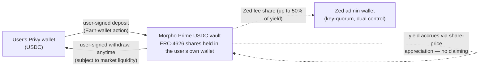

# Privy Earn — digest

**Status:** substantially answered from Privy's public docs (fetched 2026-09-14; links via Pete, eng — Slack DM 8/24). Remaining gaps flagged per section. Contractual/geographic questions need Privy the company, not the docs. Answers map to C-Q1..C-Q8 in `../track.md`.

## What it is (C-Q1 — ANSWERED)
A Privy API layer for generating yield on user wallet balances by depositing into **third-party vaults**: "Deposit into vaults, withdraw at any time, and track positions in real time, all with a few API calls." Two families:
- **DeFi lending vaults** — providers **Aave, Morpho, Kamino, Veda**. "Borrowers pay interest to access liquidity. That interest flows back to the vault, increasing the value of deposited shares." (Pete's gloss: "purely defi yield on overcollateralized assets.")
- **Tokenized Money Market Funds (TMMFs)** — invest in US Treasuries/repos; "rates track prevailing short-term benchmarks rather than onchain borrower demand."

**The user's counterparty is the vault/protocol, not Privy**: "Privy does not control DeFi vaults or underlying protocols." The API is "provider- and chain-agnostic: your app passes a vault_id and uses the same endpoints for every vault."
Source: docs.privy.io/wallets/actions/earn/overview.

## Custody model (C-Q2 — ANSWERED, favorable)
Vault positions are **ERC-4626 shares held as standard ERC-20 tokens in the user's own wallet** — "can be transferred between wallets like any other token." Yield accrues by **share-price appreciation**, "no claiming or compounding required." Self-custody survives a deposit: the user holds the receipt asset; Privy custodies nothing.
Source: overview page.

<!-- earn-flow-diagram -->

## Yield mechanics & economics (C-Q3, C-Q13 — ANSWERED)
- DeFi vault APY "fluctuates based on borrower demand, market utilization, and the curator's allocation strategy"; TMMF yield tracks short-term rates.
- **App revenue share exists and is configurable** — this is Track C's margin mechanism:
  - **Morpho:** app performance fee **up to 50% of yield**; "your app keeps the full fee; the remaining yield accrues to depositors." "Fees accrue as vault shares directly in the admin wallet."
  - **Aave:** fee up to 100%, but "yield not returned to users is split 50/50 between your app and Aave Labs" (e.g., 20% fee → user 80%, Zed 10%, Aave Labs 10%). Fees collected from vault contract via `available_fees` + collect-fees endpoint.
  - **Veda:** per custom agreement; Veda sweeps fees to the admin wallet on a schedule.
- Fees land in an **admin wallet** the app controls — must be a signing wallet ("exchange wallets, cold storage... do not work"), and Privy recommends an authorization key second factor before production.
Source: revenue-sharing + setup pages.

## Deposit / withdrawal UX (C-Q4 — PARTIAL)
Single API calls for deposit/withdraw; withdraw "at any time"; no lockups mentioned; **gas sponsorship** available if enabled. **Open: who authorizes the user-side deposit/withdraw transaction** — user-signed vs. server/session-signer initiated is not stated in the pages fetched. This matters regulatorily (it's the Earn analog of the no-unilateral-Zed-signing posture, R31/C-PR-2) → ask Privy / read the API reference. Starter template: github.com/privy-io/examples (privy-next-yield-demo).

## Assets & chains (C-Q5 — ANSWERED; SANDBOX-VERIFIED 9/16)
Self-serve vaults, confirmed live in Zed's sandbox dashboard (screenshot `inbox/processed/2026-09-16-privy-sandbox-earn-vaults.png`), matching the setup docs:
- **Gauntlet USDC Prime** — Morpho, USDC on Base — **~4.4% APY, $169M TVL**
- **Steakhouse Prime USDC** — Morpho, USDC on Base — **~4.4% APY, $435M TVL**
- **Sentora pathUSD** — Morpho, pathUSD on Tempo — ~3.2% APY, $36M TVL, plus a "limited time... 7% yield boost" promo ("terms and conditions apply") — treat as marketing, not economics
"If you are interested in participating, or looking for other vaults or providers, please reach out to sales@privy.io." Both USDC vaults are curated conservative ("Prime") Morpho vaults; curators are Gauntlet (quant risk firm, ex-Aave/Compound risk management) and Steakhouse Financial (stablecoin-focused, MakerDAO/Sky lineage). → **USDC on Base works today, self-serve**, matching Track C's coin and the incumbent's target chain. Economics note: at 4.4% gross with a 25–50% Zed fee share, users see ~2.2–3.3% — *below* the OUSD Marketing Fee's illustrative ~3.75% gross; run the real side-by-side at parameter-setting time (C-INT-3 analog for Track C).
Dashboard flow observed: "Create a vault configuration → Deposit assets → Withdraw assets with accrued earnings"; app is in development mode pending "Upgrade to production".

## Eligibility & geography (C-Q6 — STILL OPEN)
Nothing in the docs on geographic restrictions, PH availability, or KYC division of labor. This is a Privy-the-company question (terms/contract), not a docs question. **Threshold item for Track C — ask Privy directly.**

## Risk stack & disclosures (C-Q7 — PARTIAL)
Privy's own disclaimer: "Earnings are generated from third-party vaults and are not guaranteed. Using vaults involves risk, including loss of funds." Full stack for our disclosures: underlying protocol smart-contract risk, curator allocation risk, USDC depeg, vault liquidity. TMMF option adds a different risk/legal profile (see below). No insurance/backstop mentioned.

## Contractual structure (C-Q8 — PARTIAL)
Veda requires a custom agreement; Aave/Veda vaults require Privy enablement (sales); Morpho self-serve via dashboard. What Zed signs with Privy overall, and what obligations attach to Zed as the distributing app, remain open → Privy conversation.

## Comparables now on file (see sibling digests)
- Robinhood Earn: USDG lending via Morpho, self-custodial embedded wallet, est. 7% APY, **Lloyd's of London + RELM insurance** (→ part-answers C-Q7: insurance over DeFi lending risk is procurable). `robinhood-earn-case-study.md`
- Ramp: up to 3.25% rewards on held stablecoins (business). Deel: Earn vault + branded DLUSD. `privy-overview-deck.md`
- Moreta: ramp-partner + Privy + USDC in SEA incl. PH — the rent-the-license shape, live. `moreta-case-study.md`

## Facts that surprised us / matter for the comparison
1. **Self-custody is preserved through Earn** — vault shares in the user's wallet. Track C keeps the "no Zed custody" posture even while generating yield.
2. **The revenue mechanism is real and quantified**: up to 50% of yield (Morpho) configurable at vault setup. Track C's economics question (C-Q13) is now "what's the right split," not "is there a margin."
3. **TMMF option**: Treasury-backed tokenized MMF yield via the same API — economically closer to OUSD's reserve yield than DeFi lending is. But a tokenized money-market **fund share is very plausibly a security** in PH analysis — flag prominently for counsel (C-Q12). Could be a Track C variant ("C-prime") if DeFi lending characterization fails.
4. **Fee shares accrue to a Zed-controlled admin signing wallet** — a new Zed corporate wallet in the money map, analogous to the Marketing Fee payout wallet in the incumbent funds flow.

## Related Privy platform notes (from the same drop — relevant to all tracks)
- **Balance/transaction webhooks + REST balance API** (docs.privy.io/wallets/gas-and-asset-management/assets/overview): incoming-deposit and outgoing-withdrawal events on wallets "reconstituted server-side." Useful everywhere: detecting USDC arrival from the VASP partner (Track C on-ramp matching) and detecting external receipts for screening (incumbent R32/C-INT-4).
- **Custom OAuth** (docs.privy.io/authentication/user-authentication/login-methods/custom-oauth): Zed can be the OAuth provider behind Privy wallet auth — standard authorization-code flow with client id/secret (+PKCE). Note: "once users are created under a custom OAuth provider, the configuration cannot be deleted." **Superseded in part (9/14):** Pete's "only the traditional pre-shared-key flow" applied to this custom-OAuth method; Privy separately supports **JWT/OIDC bring-your-own-auth** (any OIDC-compliant provider) — the better fit for D7 session handoff. See `privy-tech-docs.md`.

## Source docs
| Doc | Received | Processed | Notes |
|---|---|---|---|
| docs.privy.io/wallets/actions/earn/overview | 9/14 (Slack DM from Pete, 8/24) | 9/14 | Structure, custody, providers, risk |
| docs.privy.io/wallets/actions/earn/setup | 9/14 (followed from overview) | 9/14 | Self-serve vaults, admin wallet, vault_id API |
| docs.privy.io/wallets/actions/earn/revenue-sharing | 9/14 (followed from overview) | 9/14 | Fee mechanics per provider |
| docs.privy.io/wallets/gas-and-asset-management/assets/overview | 9/14 (Pete) | 9/14 | Webhooks/balances (platform note) |
| docs.privy.io/authentication/user-authentication/login-methods/custom-oauth | 9/14 (Pete) | 9/14 | Custom OAuth (platform note) |
| Privy overview deck (DocSend, 14 slides) | 9/14 (Steve) | 9/14 | Platform claims + yield comparables |
| Privy blog: Moreta | 9/14 (Steve) | 9/14 | SEA QR payments; ramp-partner compliance model |
| Privy blog: Robinhood Earn | 9/14 (Steve) | 9/14 | Self-custodial Morpho lending; insurance layer |
| Privy tech docs ×7 (security, JWT auth, user wallets, actions, flows, gas, controls) | 9/14 (Privy contact via Steve) | 9/14 | Custody statements, C-Q4 signing answer, governance/quorums → `privy-tech-docs.md` |
