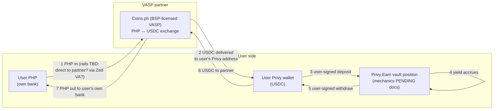

# Track C — USDC accounts via VASP partnership + Privy Earn yield

**Status:** exploring · opened 2026-09-14 · **awaiting Steve's Privy docs** (drop in `inbox/track-c/` → they get digested into `research/`)
**Thesis:** Instead of engineering Zed out of the licensing perimeter (Track 0) or into it (A/B), **rent the license**: a BSP-licensed PH VASP partner (working candidate: Coins.ph) performs the regulated PHP↔crypto exchange leg, the customer's **USDC** lands in their **Privy wallet**, and yield comes from **Privy Earn** (vault deposits) rather than an issuer reserve-share. No Bridge, no OUSD, no Open Standard dependency — this is the one track that hedges the whole OS/Bridge stack.

Two structural notes up front:
1. This *reintroduces* a VASP into the money path — the thing the 8/28 memo deliberately removed from treasury (memo §4). The difference: there it was an *unnecessary* insertion into Zed's own-account FX; here the VASP is the *licensed principal for the customer's exchange*, which is the partner's legitimate regulated role. Same vendor, opposite legal function. Counsel framing matters (C-Q10).
2. The yield is **DeFi lending yield**, not reserve yield. Economically and legally a different animal: variable, protocol-risk-bearing, and the securities/"investment product" analysis is likely *harder*, not easier, than the OUSD Marketing Fee structure (C-Q12).

## Hypothesized architecture (all PENDING until Privy docs + Coins.ph model confirmed)

The load-bearing unknowns are the two seams: **(1→2)** who is the partner's customer (the user directly? Zed on the user's behalf?) and **(2/6)** whether the partner supports third-party wallet delivery/receipt (their own closed-loop policies may fight this).

## Research questions

**Privy Earn (answer from Steve's docs → `research/privy-earn.md`):**
- **C-Q1.** What *is* Privy Earn structurally — Privy-operated product, or integration rails into third-party vaults/protocols (which ones)? Who is the user's counterparty?
- **C-Q2.** Custody/possession: does the user's wallet hold vault shares/receipt tokens directly (self-custody preserved), or does Privy/a partner take possession?
- **C-Q3.** Yield source and range; how variable; who sets/skims; is there a Zed fee-share or margin mechanism?
- **C-Q4.** Deposit/withdraw mechanics: user-signed? gas? timing/liquidity constraints, lockups, caps?
- **C-Q5.** Supported assets/chains — USDC on which chains; minimums.
- **C-Q6.** Geographic/eligibility restrictions — **is PH allowed?** KYC obligations on whom?
- **C-Q7.** Risk stack: underlying protocol risk, depeg, smart-contract, any insurance/guarantees; what disclosures Privy requires of distributors.
- **C-Q8.** Contractual: who signs what with whom (Zed↔Privy? user↔Privy? user↔protocol?) and what Zed's regulatory exposure is as the app distributing access.

**VASP partner (Coins.ph or alternative):**
- **C-Q9.** Partnership models on offer: B2B API where users become Coins.ph customers? White-label ramp? Can they deliver USDC to an external (Privy) address on-ramp and accept from it on off-ramp? Fees, limits, settlement times.
- **C-Q10.** Legal shape: if users are Coins.ph exchange customers, Zed's role is referral/UI + wallet software — what licensing (if any) does *that* attract? Does Privy-Earn-in-Zed's-UI change the answer? `PENDING counsel`
- **C-Q11.** The 8/16 caution on Coins.ph (D8: their API code untrusted, wallet structure Coins-domain) was about *our old integration*, not their institutional capability — but re-underwrite operationally: API quality for this flow, support model. `Zed eng`

**Characterization:**
- **C-Q12.** Securities/consumer analysis of offering DeFi lending yield to PH retail through Zed's app — versus the Marketing-Fee/Zed-Rewards structure. Does Earn make Zed an offeror of *someone else's investment product* (worse than CASP-adjacent?) `PENDING counsel`
- **C-Q13.** USDC economics without a Marketing Fee: is there any issuer-side revenue (Circle partner programs?) or is vault yield-share the entire margin? `Steve/Privy docs`

## What this track deliberately gives up

- OUSD Marketing Fee + OS equity earn-in program (PRD §2a) — replaced by vault economics (C-Q3/C-Q13).
- The "no VASP anywhere near the product" purity of the 8/28 positioning — replaced by "the VASP is the licensed one doing licensed things."
- Bridge relationship leverage (KYB already in flight) — though Bridge/Privy relationships are independent; Privy stays either way.

## Decision log

| Date | Event |
|---|---|
| 2026-09-14 | Track opened at Steve's direction. Blocking input: Privy Earn docs (Steve has them; drop in `inbox/track-c/`). Second input: Coins.ph partnership model (C-Q9). |
