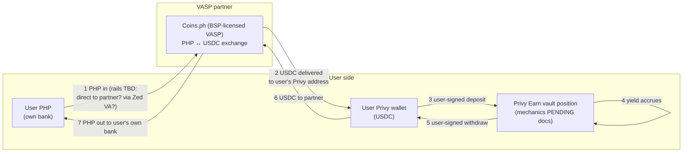

# Track C — USDC accounts via VASP partnership + Privy Earn yield

**Status:** exploring · opened 2026-09-14 · Privy Earn docs + overview deck + Moreta/Robinhood case studies digested 2026-09-14 (`research/` — C-Q1/2/3/5 answered, C-Q13 mechanism confirmed, C-Q7 part-answered by the Robinhood Lloyd's/RELM insurance precedent; **C-Q6 PH eligibility is the open threshold item**). Strongest comparable: Robinhood Earn = self-custodial Morpho lending in a retail app, est. 7% APY.
**Thesis:** Instead of engineering Zed out of the licensing perimeter (Track 0) or into it (A/B), **rent the license**: a BSP-licensed PH VASP partner (working candidate: Coins.ph) performs the regulated PHP↔crypto exchange leg, the customer's **USDC** lands in their **Privy wallet**, and yield comes from **Privy Earn** (vault deposits) rather than an issuer reserve-share. No Bridge, no OUSD, no Open Standard dependency — this is the one track that hedges the whole OS/Bridge stack.

Two structural notes up front:
1. This *reintroduces* a VASP into the money path — the thing the 8/28 memo deliberately removed from treasury (memo §4). The difference: there it was an *unnecessary* insertion into Zed's own-account FX; here the VASP is the *licensed principal for the customer's exchange*, which is the partner's legitimate regulated role. Same vendor, opposite legal function. Counsel framing matters (C-Q10).
2. The yield is **DeFi lending yield**, not reserve yield. Economically and legally a different animal: variable, protocol-risk-bearing, and the securities/"investment product" analysis is likely *harder*, not easier, than the OUSD Marketing Fee structure (C-Q12).

## Hypothesized architecture (all PENDING until Privy docs + Coins.ph model confirmed)

The load-bearing unknowns are the two seams: **(1→2)** who is the partner's customer (the user directly? Zed on the user's behalf?) and **(2/6)** whether the partner supports third-party wallet delivery/receipt (their own closed-loop policies may fight this).

## Research questions

**Privy Earn (digest: `research/privy-earn.md`, from public docs 9/14):**
- **C-Q1.** ✅ ANSWERED — API rails into third-party vaults (Aave/Morpho/Kamino/Veda DeFi lending + tokenized MMFs); user's counterparty is the vault/protocol, "Privy does not control" them.
- **C-Q2.** ✅ ANSWERED — self-custody preserved: ERC-4626 vault shares sit in the user's wallet as ordinary ERC-20s; yield via share-price appreciation.
- **C-Q3.** ✅ ANSWERED — variable protocol yield; **configurable app fee share (up to 50% of yield on Morpho)** accruing to a Zed-controlled admin signing wallet.
- **C-Q4.** ✅ SUBSTANTIALLY ANSWERED (docs level) — wallet-actions docs (9/14): `earn` is a wallet action requiring an **authorization signature over the request** from the wallet's owner/signer, TEE-verified — for user-owned wallets, that's the user. Gas: app-sponsored (EIP-7702 paymasters) or user-pays in USDC. Residual: verify in sandbox + confirm the BYO-auth token nuance (see C-PR-2). Moreta caution stands: lock the config.
- **C-Q5.** ✅ ANSWERED (today's set) — **USDC on Base, self-serve** (Gauntlet USDC Prime, Steakhouse Prime Instant); more via sales.
- **C-Q6.** ⛔ OPEN — **threshold item**: PH eligibility / geographic restrictions / KYC split are absent from the docs; this is a Privy-the-company (terms) question.
- **C-Q7.** ◐ PARTIAL — "not guaranteed... risk, including loss of funds"; full protocol/curator/depeg/liquidity stack for disclosures still to assemble; no insurance mentioned.
- **C-Q8.** ◐ PARTIAL — Morpho self-serve via dashboard; Aave/Veda need Privy sales enablement; Veda needs a custom agreement; the Zed↔Privy contract and distributor obligations remain open.
- **C-Q14** *(new)*. The **TMMF option** (Treasury-backed tokenized money-market funds via the same API): economically closest to OUSD reserve yield, but a fund share is plausibly a *security* in PH analysis — counsel question; possible "C-prime" variant if DeFi-lending characterization fails. `PENDING counsel`

**VASP partner (Coins.ph or alternative):**
- **C-Q9.** Partnership models on offer: B2B API where users become Coins.ph customers? White-label ramp? Can they deliver USDC to an external (Privy) address on-ramp and accept from it on off-ramp? Fees, limits, settlement times.
- **C-Q10.** Legal shape: if users are Coins.ph exchange customers, Zed's role is referral/UI + wallet software — what licensing (if any) does *that* attract? Does Privy-Earn-in-Zed's-UI change the answer? `PENDING counsel`
- **C-Q11.** The 8/16 caution on Coins.ph (D8: their API code untrusted, wallet structure Coins-domain) was about *our old integration*, not their institutional capability — but re-underwrite operationally: API quality for this flow, support model. `Zed eng`

**Characterization:**
- **C-Q12.** Securities/consumer analysis of offering DeFi lending yield to PH retail through Zed's app — versus the Marketing-Fee/Zed-Rewards structure. Does Earn make Zed an offeror of *someone else's investment product* (worse than CASP-adjacent?) `PENDING counsel`
- **C-Q13.** USDC economics without a Marketing Fee: is there any issuer-side revenue (Circle partner programs?) or is vault yield-share the entire margin? `Steve/Privy docs`

## Bookmarked deep dives (Steve, 9/16)

- **C-Q15 — Morpho protocol mechanics under stress.** Build deep understanding of the lending protocol itself before committing user funds: collateralization mechanics (isolated markets, LLTV parameters, oracles), the liquidation machinery, and vault liquidity dynamics — specifically **what happens under sudden volatility or a black-swan move in the volatile crypto collateral** (ETH/BTC variants, LSTs) that backs otherwise-stable USDC lending. Questions to answer: liquidation cascade behavior, bad-debt socialization (who eats losses and in what order), oracle failure modes, withdrawal availability when markets are fully utilized mid-crash, historical stress episodes (how did Morpho/Aave-style markets behave in past drawdowns). Deliverable: **"Understanding Onchain Lending: Aave, Morpho, and the Zed USDC Yield Decision"** — collaborative Claude Doc (claude.ai/code/artifact/dbbf6d2c-9350-440c-afdf-034366d3151d; Steve comments/edits there, Claude revises in place). Google Doc export happens at release time for wider distribution (interim Google copies trashed to keep one source of truth) — v1 drafted 9/17, under Steve+Claude review; also carries the Aave-vs-Morpho explainer and the Part VI product-decision framework (options A–E, preliminary lean: single Morpho Prime vault for pilot). Vault-diligence findings will be mirrored into `research/` when the doc stabilizes. Status: **v1 draft in review**.

## What this track deliberately gives up

- OUSD Marketing Fee + OS equity earn-in program (PRD §2a) — replaced by vault economics (C-Q3/C-Q13).
- The "no VASP anywhere near the product" purity of the 8/28 positioning — replaced by "the VASP is the licensed one doing licensed things."
- Bridge relationship leverage (KYB already in flight) — though Bridge/Privy relationships are independent; Privy stays either way.

## Decision log

| Date | Event |
|---|---|
| 2026-09-14 | Track opened at Steve's direction. Blocking input: Privy Earn docs (Steve has them; drop in `inbox/track-c/`). Second input: Coins.ph partnership model (C-Q9). |
| 2026-09-14 | Privy docs/deck/case studies digested (see `research/`). **Privy sandbox app created: App ID `cmsxvzv9e00ad0cjsiqvmxjha`** — sandbox verification of the Earn flow (C-Q4 residual, vault list, eligibility surfaces) is now unblocked. |
